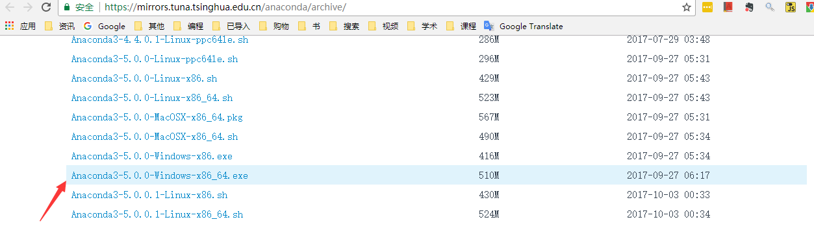
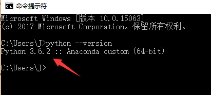
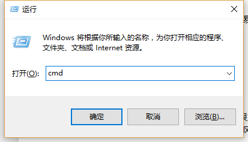
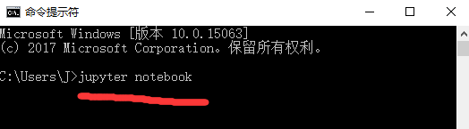
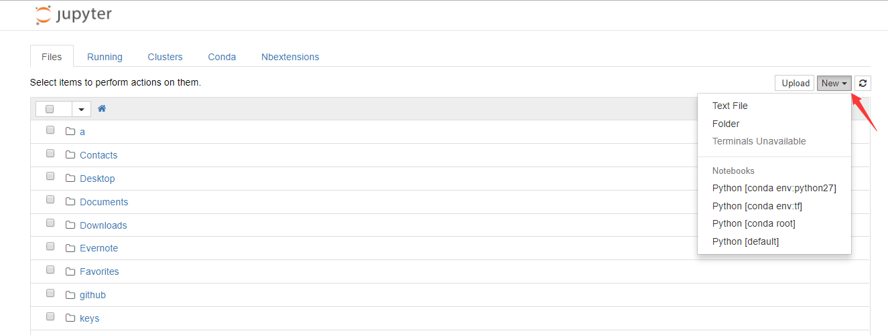
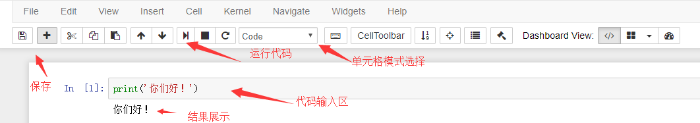
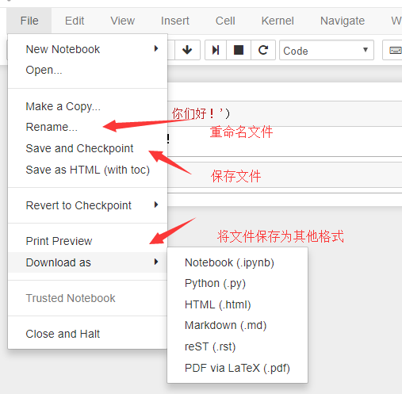
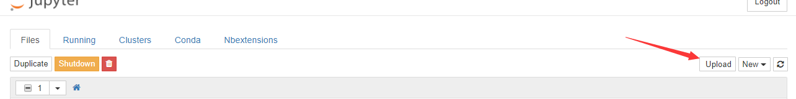
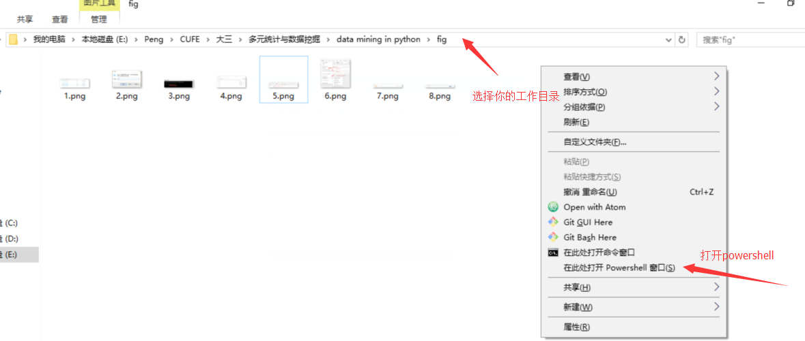
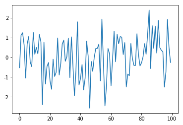

 # Table of Contents
<div class="toc" style="margin-top: 1em;"><ul class="toc-item" id="toc-level0"><li><span><a href="#python-环境搭建" data-toc-modified-id="python-环境搭建-1"><span class="toc-item-num">1&nbsp;&nbsp;</span>python 环境搭建</a></span><ul class="toc-item"><li><span><a href="#安装" data-toc-modified-id="安装-1.1"><span class="toc-item-num">1.1&nbsp;&nbsp;</span>安装</a></span><ul class="toc-item"><li><span><a href="#下载" data-toc-modified-id="下载-1.1.1"><span class="toc-item-num">1.1.1&nbsp;&nbsp;</span>下载</a></span></li><li><span><a href="#python版本问题" data-toc-modified-id="python版本问题-1.1.2"><span class="toc-item-num">1.1.2&nbsp;&nbsp;</span>python版本问题</a></span></li></ul></li><li><span><a href="#jupyter" data-toc-modified-id="jupyter-1.2"><span class="toc-item-num">1.2&nbsp;&nbsp;</span>jupyter</a></span><ul class="toc-item"><li><span><a href="#打开jupyter" data-toc-modified-id="打开jupyter-1.2.1"><span class="toc-item-num">1.2.1&nbsp;&nbsp;</span>打开jupyter</a></span></li><li><span><a href="#jupyter操作" data-toc-modified-id="jupyter操作-1.2.2"><span class="toc-item-num">1.2.2&nbsp;&nbsp;</span>jupyter操作</a></span></li><li><span><a href="#选择在不同的工作目录下运行jupyter" data-toc-modified-id="选择在不同的工作目录下运行jupyter-1.2.3"><span class="toc-item-num">1.2.3&nbsp;&nbsp;</span>选择在不同的工作目录下运行jupyter</a></span></li></ul></li><li><span><a href="#包管理" data-toc-modified-id="包管理-1.3"><span class="toc-item-num">1.3&nbsp;&nbsp;</span>包管理</a></span><ul class="toc-item"><li><span><a href="#python数据挖掘主要使用的包" data-toc-modified-id="python数据挖掘主要使用的包-1.3.1"><span class="toc-item-num">1.3.1&nbsp;&nbsp;</span>python数据挖掘主要使用的包</a></span></li><li><span><a href="#包安装" data-toc-modified-id="包安装-1.3.2"><span class="toc-item-num">1.3.2&nbsp;&nbsp;</span>包安装</a></span></li><li><span><a href="#包的使用" data-toc-modified-id="包的使用-1.3.3"><span class="toc-item-num">1.3.3&nbsp;&nbsp;</span>包的使用</a></span></li></ul></li></ul></li></ul></div>

# python 环境搭建


## 安装

[Anaconda](https://www.anaconda.com/)是一个用于科学计算的Python发行版，支持 Linux, Mac, Windows系统，提供了包管理与环境管理的功能，可以很方便地解决多版本python并存、切换以及各种第三方包安装问题。Anaconda利用工具/命令conda来进行package和environment的管理，并且已经包含了Python和相关的配套工具。

### 下载
- 官网下载：https://www.anaconda.com/download/
- 清华大学镜像下载：https://mirrors.tuna.tsinghua.edu.cn/anaconda/archive/ (推荐）

推荐使用清华大学镜像下载，选择对应的版本，如："Anaconda3-5.0.0-Windows-x86_64.exe".

下载好之后默认安装就好，最后会询问是否加入到系统变量，选择加入。

### python版本问题

Python有两个支持的版本，分别是2.7和3.5+。3.0以上的版本与2.7版本有了不少的改动，所以在3.0+的版本中2.7的语句有些是编译不成功的。本教程使用的版本是3.5+版本。要想查看python的版本，可以在cmd命令行中输入 `python --version` 来查看 


## jupyter

### 打开jupyter

- 下载好了之后,按 `win(开始键)`+`R` 然后输入`cmd`后点确定，会弹出一个界面。
- 在弹出的界面里面输入`jupyter notebook`,会弹出一个网页.
- 点击右上角的 `new` 选择 `python3` 即可创建并打开一个新的可运行 python`的笔记本jupyter。

  

### jupyter操作

主要：代码运行、保存、文件重命名、文件上传

在单元框里面写入代码后，按`Shift`+`Enter`键即可运行代码，显示结果。也可以选择导航栏中的按钮运行代码。

按左上角的保存键即可保存文件,或者按file下的save and checkpoint。


文件上传在jupyter主界面点右上角的upload后选择要上传的文件，再点一次upload即可上传文件。
 

### 选择在不同的工作目录下运行jupyter
打开你要运行的工作目录，也就是打开你要存放代码的文件夹，然后按住Shift和右键,点击在此处点击打开命令行窗口或者打开powershell，然后和之前的一样，输入jupyter notebook即可在这个文件夹下打开jupyter，而且文件也保存在这个文件夹下，可以方便读取和存储数据在这个文件夹下。


## 包管理

### python数据挖掘主要使用的包
python本身的非常小，编写简单，容易上手。又由于python有各种各样的拓展包，所以python的功能非常强大。在数据挖掘领域，我们主要使用的拓展包为：
 - NumPy
 - SciPy
 - Pandas
 - Matplotlib
 - Sklearn


 其中[`NumPy`](http://www.numpy.org/)是科学运算的基础，可以很方便的对数据进行多个维度操作。 [`SciPy`](https://www.scipy.org/)是一个基于python的数据科学运算体系，包括优化(scipy.optimize), 线性代数(scipy.optimize), 统计分析(scipy.optimize)等强大的算法。[`Pandas`](https://pandas.pydata.org/)是一个提供快速，灵活和表达性数据结构，能够使“关系”或“标记”数据变得简单直观。[`Matplotlib`](https://matplotlib.org/)是类似于Matlab画图风格的强大2d画图工具。[`Sklearn`](http://scikit-learn.org/)是一个基于python的机器学习库，里面包含各种机器学习算法。


- Python的官方教程: https://docs.scipy.org/doc/numpy-dev/user/quickstart.html
- NumPy的官方教程: https://docs.scipy.org/doc/numpy-dev/user/quickstart.html
- Pandas的官方教程：https://pandas.pydata.org/pandas-docs/stable/index.html
- SciPy官方教程： http://scipy.github.io/devdocs/tutorial/index.html
- Matplotlib的官方教程： https://matplotlib.org/tutorials/index.html
- Sklearn的官方教程：http://scikit-learn.org/stable/tutorial/index.html

### 包安装

- 在 cmd 或者 powershell 中输入 `pip install 要安装的包的名称` 即可自动下载安装。
- 有些包在win系统下pip安装可能不成功,可以输入 `conda install 要安装的包的名称` 进行安装。

如，你想安装`numpy`(已经存在了）这个包，你在cmd或者powershell中输入 `pip install numpy` 即可

### 包的使用
安装好需要的包之后，只用在代码中导入需要的使用的包，即可使用该包。


```python
## 导入numpy包，并用np简化命名
import numpy as np

##生成1个0-100个随机整数
print(np.random.randint(0,100))
```

    7


```python
## 导入matplotlib中的pyplot包，并简化命名为plt
import matplotlib.pyplot as plt

##让图像在显示在界面中
%matplotlib inline

## 用numpy生成100个正态分布随机数，然后用matpoltlib画图
plt.plot(np.random.randn(100))
```


    [<matplotlib.lines.Line2D at 0x2124e7d6470>]



