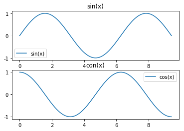

# Python Tutorial

教程内容包括：

- **Python**
- **NumPy**
- **Pandas**
- **Matplotlib**

## Python
Python是一种高级的，动态类型的多范型编程语言。很多时候，大家会说Python看起来简直和伪代码一样，这是因为你能够通过很少行数的代码表达出很有力的思想。

内容包括：
- 基础数据类型
- 复合数据类型
- 控制语句
- 循环

参考：
- 官方教程：https://docs.python.org/3/tutorial/index.html
- Python 入门指南: http://www.pythondoc.com/pythontutorial3/index.html
- 廖雪峰python教程： https://www.liaoxuefeng.com/wiki/0014316089557264a6b348958f449949df42a6d3a2e542c000
- CS231n python 教程：http://cs231n.github.io/python-numpy-tutorial/

### 基础数据类型

和大多数编程语言一样，Python拥有一系列的基本数据类型，比如整型、浮点型、布尔型和字符串等。这些类型的使用方式和在其他语言中的使用方式是类似的。

- **数值型**
- **字符串**
- **布尔型**

#### 数值型


```python
x = 5
type(x)
```


    int


```python
print(x + 2) ## 加
print(x - 2) ## 减
print(x * 2) ## 乘
print(x / 2) ## 除
print(x // 2)  ## 整除
print(x % 2) ## 求余
print(x ** 2) ##指数运算
```

    7
    3
    10
    2.5
    2
    1
    25


#### 字符串
Python对字符串的支持非常棒。字符串可以用单引号`'`或者双引号`"`引起来。


```python
hello = 'hello'
world = "world"
print(hello) ##打印字符串
print(len(hello)) ##求字符串长度

hw = hello + ' ' + world + '!'##字符串相加
print(hw)

print(hello, 100) ##打印不同东西可以用 逗号',' 隔开
```

    hello
    5
    hello world!
    hello 100


字符串对象有一系列有用的方法


```python
s = 'hello'
print(s.capitalize())##首字母大写
print(s.upper())   ## 全部大写
print(s.replace('e', 'E'))  ##替换字符串

print('   hello  ')
print('   hello  '.strip()) ## 去除字符串的空格
```

    Hello
    HELLO
    hEllo
       hello  
    hello


### 复合数据类型

- 列表 list:[]
- 字典 dict:{}
- 集合 set()
- 元组 truple :()

#### 列表 list
用[]表示列表。

list 就是 Python 中的数组，但是列表长度可变，且能包含不同类型元素。

- 注意python的序号是从0开始计数的，与c语言一样，[0]表示取第1个元素
- [a:b] 数学上表示[a,b)这个左闭右开的集合，所以选择的是从第a个到第b-1个元素


##### 创建列表


```python
xs = [0,1,2,3,4,5]
xs
```


    [0, 1, 2, 3, 4, 5]


```python
## 列表长度
len(xs)
```


    6


##### 访问列表


```python
xs[0]
```


    0


```python
##切片访问
xs[0:2]
```


    [0, 1]


```python
## 用负数代表从后往前数
xs[0:-1]
```


    [0, 1, 2, 3, 4]


```python
## 访问所有
xs[:]
```


    [0, 1, 2, 3, 4, 5]


```python
## 访问偶数序号
xs[::2]
```


    [0, 2, 4]


##### 添加元素


```python
xs.append(10)
xs
```


    [0, 1, 2, 3, 4, 5, 10]


##### 删除元素


```python
## 按位置删除元素
xs.pop(-1)
xs
```


    [0, 1, 2, 3, 4, 5]


```python
## 删除指定元素
xs.remove(3)
xs
```


    [0, 1, 2, 4, 5]


##### 修改元素


```python
## 按序号修改
xs[0] = 999
xs
```


    [999, 1, 2, 4, 5]


```python
## 切片修改
xs[0:2] = [-999, -999]
xs
```


    [-999, -999, 2, 4, 5]


##### 遍历列表


```python
animals = ['cat', 'dog', 'monkey']
for animal in animals:
    print(animal)
```

    cat
    dog
    monkey


```python
## 也可以添加每个位置的指针
for i, animal in enumerate(animals):
    print(i, animal)
```

    0 cat
    1 dog
    2 monkey


##### 列表推导 List comprehensions
当我们想对列表中每个元素进行同样的操作的时候，可以用 for 循环来对每个元素进行操作，也可以直接用列表推导来操作。

比如我么想对每个元素都进行平方操作：


```python
## for循环
x = [1, 2, 3, 4, 5]
x2 = []
for i in x:
    x2.append(i ** 2)
x2
```


    [1, 4, 9, 16, 25]


```python
## 直接用列表推导
x3 = [i**2 for i in x]
x3
```


    [1, 4, 9, 16, 25]


```python
## 也可以在列表推导里面加入条件判断
x4 = [ i**2 for i in x if i%2 == 0]
x4
```


    [4, 16]


#### 字典dict

用{key: value}表示。

字典用来储存（键key, 值value），通过建立key和value之间的对应关系，我们就可以通过key很快的找到value。

##### 创建字典
比如我们要建立一个学生与成绩对应的字典：


```python
grade = {'Jedan': 100, 'Bob': 90, 'Mike': 80}
grade
```


    {'Bob': 90, 'Jedan': 100, 'Mike': 80}


##### 访问字典


```python
grade['Jedan']
```


    100


```python
## 或者通过get属性访问字典（推荐）
grade.get('Jedan')
```


    100


##### 添加元素


```python
grade['new_one'] = 60
grade
```


    {'Bob': 90, 'Jedan': 100, 'Mike': 80, 'new_one': 60}


##### 修改key对应的value


```python
grade['new_one'] = 70
grade
```


    {'Bob': 90, 'Jedan': 100, 'Mike': 80, 'new_one': 70}


##### 删除


```python
grade.pop('new_one')
grade
```


    {'Bob': 90, 'Jedan': 100, 'Mike': 80}


##### 遍历字典


```python
for key, value in grade.items():
    print(key, value)
```

    Jedan 100
    Bob 90
    Mike 80


#### 集合set
用{}表示

set和数学中的集合有相同的性质，即无序，元素不重复，所以不能通过序号来选取元素


```python
grade = [100, 90, 95 , 90, 85, 100]
grade
```


    [100, 90, 95, 90, 85, 100]


##### 创建set


```python
grade_set = set(grade)
grade_set
```


    {85, 90, 95, 100}


##### 添加元素


```python
grade_set.add(60)
grade_set
```


    {60, 85, 90, 95, 100}


##### 删除元素


```python
grade_set.remove(60)
grade_set
```


    {85, 90, 95, 100}


##### 求元素长度
这个可以对很多有重复的list，通过set求不同元素的个数


```python
print(len(grade_set))
len(set([100,100,100,90,90,90]))
```

    4


    2


#### 元组Tuples
用()表示

元组是一个值的有序列表（不可改变）。从很多方面来说，元组和列表都很相似。和列表最重要的不同在于，元组可以在字典中用作键key，还可以作为集合的元素，而列表不行。


```python
data = {(x, x + 1): x for x in range(10)}
data
```


    {(0, 1): 0,
     (1, 2): 1,
     (2, 3): 2,
     (3, 4): 3,
     (4, 5): 4,
     (5, 6): 5,
     (6, 7): 6,
     (7, 8): 7,
     (8, 9): 8,
     (9, 10): 9}


### 控制语句
- for 循环
- while 循环
- if 条件语句

所有的控制语句后面都必须有冒号：表示，否则编译不成功

#### for 循环
在python中 for 循环可以完成绝大部分循环功能。

##### `for a in b:`
表示将b中的元素一个一个赋值给a直到所有结束


```python
words = ['cat', 'dog', 'good', 'hello']
for word in words:
    print(word, len(words))
```

    cat 4
    dog 4
    good 4
    hello 4


##### range()
range(a,b)表示生成一个[a, b)的整数列表a默认为0，则range(10)表示生成0到9一共10个整数


```python
for i in range(10):
    print(i)
```

    0
    1
    2
    3
    4
    5
    6
    7
    8
    9


```python
for i in range(len(words)):
    print(i, words[i])
```

    0 cat
    1 dog
    2 good
    3 hello


#### while 和 if
while 和 if 使用与c语言相差不大


```python
n = 3
x = 10
y = x
while n != 0 :
    y = y * x
    n = n - 1
y
```


    10000


```python
x = 100
if x % 10 == 0:
    print('x是10的倍数')
else:
    print('x不是10的倍数')
```

    x是10的倍数


### 函数

Python用 `def` 定义 函数，`def 函数名(要传入的参数):` 注意不要漏了后面的冒号，否是编译失败。另外，函数的内容必须与函数首部有一个`tab`键的缩进，否则也会失败。

另外，和c语言一样，传入函数的参数只在函数内部有效，出了函数则无效

#### 函数定义
比如我们要定义平方公式:


```python
def power_2(x):
    y = x * x
    return y
```


```python
power_2(10)
```


    100


```python
## x的n次方
def power_n(x, n):
    y = x
    for i in range(1,n):
        y = x * y
    return y
```


```python
power_n(10, n=3)
```


    1000


#### 函数默认值
如果我们想定义一个n次方函数，可是我们常用的是平方，如果每次都要写n=2就有点麻烦了。所以可以在定义的时候就是先默认n=2这样计算平方的时候只用指定x就可以了，想要计算n次方，像之前那样指定n就可以了。


```python
def power(x, n=2):
    y = x
    for i in range(1,n):
        y = x * y
    return y
```


```python
power(10)
```


    100


```python
power(10, 4)
```


    10000


## NumPy
Numpy是Python中用于科学计算的核心库。它提供了高性能的多维数组对象，以及相关工具。

内容包含：
 - 数组array的基本操作
 - 数组的运算

参考：
- Numpy quickstart tutorial ：https://docs.scipy.org/doc/numpy-dev/user/quickstart.html

### 数组Arrays

简单来说，NumPy的对象就是一个多维数组。它由不同的元素组成一个表，所有的元素类型都相同，并且可以通过整数来访问元素。在NumPy中，维度称为轴（axes），维度的个数是秩（rank），数组的大小是一个由整型数构成的元组，可以描述数组不同维度上的大小。


```python
## 导入numpy
import numpy as np
```

#### 创建数组

##### 1维


```python
a = np.array([1,2,3,4,5])
a
```


    array([1, 2, 3, 4, 5])


##### 2 维


```python
b = np.array([[1,2,3],[4,5,6],[7,8,9]])
b
```


    array([[1, 2, 3],
           [4, 5, 6],
           [7, 8, 9]])


```python
## 数组的维度
b.shape
```


    (3, 3)


##### 0数组


```python
c = np.zeros([3,3])
c
```


    array([[ 0.,  0.,  0.],
           [ 0.,  0.,  0.],
           [ 0.,  0.,  0.]])


##### 单位数组


```python
d = np.ones([3,3])
d
```


    array([[ 1.,  1.,  1.],
           [ 1.,  1.,  1.],
           [ 1.,  1.,  1.]])


##### 随机数组


```python
## 标准正态
e = np.random.randn(3,3)
e
```


    array([[  5.50864964e-01,   5.81821800e-01,   3.77462077e-01],
           [ -1.99984540e+00,   1.93020102e-01,   5.13948103e-04],
           [ -1.89707738e+00,   6.30736571e-01,  -8.42767663e-01]])


```python
## 0,1 均匀分布
f = np.random.rand(3,3)
f
```


    array([[ 0.48710492,  0.76725375,  0.97087062],
           [ 0.91897568,  0.0903537 ,  0.25937125],
           [ 0.11031977,  0.58737946,  0.13152459]])


#### 访问数组

##### 切片访问
切片和Python列表类似，numpy数组可以使用切片语法。因为数组可以是多维的，所以你必须为每个维度指定好切片。


```python
a = np.array([[1,2,3,4], [5,6,7,8], [9,10,11,12], [13,14,15,16]])
a
```


    array([[ 1,  2,  3,  4],
           [ 5,  6,  7,  8],
           [ 9, 10, 11, 12],
           [13, 14, 15, 16]])


```python
a[2,2]
```


    11


```python
## 取a中第0维的第1到3序列的元素，取第1维的第2到3序列的元素
a[0:3,1:3]
```


    array([[ 2,  3],
           [ 6,  7],
           [10, 11]])


##### 整数访问


```python
## 取a第0维的第1和第4序列元素，第1维的第2和第4个元素
a[[0, 3], [1, 3]]
```


    array([ 2, 16])


##### 布尔型数组访问


```python
a = np.array([[1,2], [3, 4], [5, 6]])
a
```


    array([[1, 2],
           [3, 4],
           [5, 6]])


```python
bool_idx = (a > 2)
bool_idx
```


    array([[False, False],
           [ True,  True],
           [ True,  True]], dtype=bool)


```python
a[bool_idx]
```


    array([3, 4, 5, 6])


```python
## 合起来就是
a[a > 2]
```


    array([3, 4, 5, 6])


为了教程的简洁，有很多数组访问的细节我们没有详细说明，可以查看[文档](https://docs.scipy.org/doc/numpy/reference/arrays.indexing.html)。

### 数组运算

像Matlab一样，NumPy既可以对数组进行逐个元素运算，也可以进行矩阵运算。一般默认是逐个元素运算。

#### 逐个元素运算


```python
x = np.array([[1,2],[3,4]])
y = np.array([[5,6],[7,8]])
```


```python
x + y
```


    array([[ 6,  8],
           [10, 12]])


```python
x * y
```


    array([[ 5, 12],
           [21, 32]])


```python
x ** y
```


    array([[    1,    64],
           [ 2187, 65536]], dtype=int32)


#### 内置函数


##### 求和 np.sum


```python
x = np.array([[ 0,  1,  2,  3],
       [ 4,  5,  6,  7],
       [ 8,  9, 10, 11],
       [12, 13, 14, 15]])
x
```


    array([[ 0,  1,  2,  3],
           [ 4,  5,  6,  7],
           [ 8,  9, 10, 11],
           [12, 13, 14, 15]])


```python
## 全部求和
np.sum(x)
```


    120


```python
## 对某个维度求和,如对第0维
np.sum(x, axis=0)
```


    array([24, 28, 32, 36])


想要了解更多函数，可以查看[文档](https://docs.scipy.org/doc/numpy/reference/routines.math.html)。

#### 数组矩阵运算

##### 矩阵相乘


```python
x = np.array([[1,2],[3,4]])
y = np.array([[5,6],[7,8]])
```


```python
np.dot(x, y)
```


    array([[19, 22],
           [43, 50]])


#### 广播（boardcast）
广播是一种强有力的机制，它让NumPy可以让不同大小的矩阵在一起进行数学计算。
我们常常会有一个小的矩阵和一个大的矩阵，然后我们会需要用小的矩阵对大的矩阵做一些计算。

举个例子，如果我们想要把一个向量加到矩阵的每一行，我们可以通过循环将向量与矩阵每行分别进行相加


```python
x = np.array([[1,2,3],[4,5,6],[7,8,9],[10,11,12]])
x
```


    array([[ 1,  2,  3],
           [ 4,  5,  6],
           [ 7,  8,  9],
           [10, 11, 12]])


```python
y = np.array([1,0,1])
y
```


    array([1, 0, 1])


```python
v= np.empty_like(x)
for i in range(x.shape[0]):
    v[i, :] = x[i, :] + y
v
```


    array([[ 2,  2,  4],
           [ 5,  5,  7],
           [ 8,  8, 10],
           [11, 11, 13]])


当x的维度非常大的时候，这样的循环开销的非常大。换一种思路是将向量先拓展成矩阵的维度，然后再进行两者相加。


```python
y_expand = np.tile(y, (x.shape[0], 1))
y_expand
```


    array([[1, 0, 1],
           [1, 0, 1],
           [1, 0, 1],
           [1, 0, 1]])


```python
x + y_expand
```


    array([[ 2,  2,  4],
           [ 5,  5,  7],
           [ 8,  8, 10],
           [11, 11, 13]])


更方便的是，Numpy广播机制可以让我们不用创建y_expand，就能直接运算


```python
x + y
```


    array([[ 2,  2,  4],
           [ 5,  5,  7],
           [ 8,  8, 10],
           [11, 11, 13]])


对两个数组使用广播机制要遵守下列规则：

 - 如果数组的秩不同，使用1来将秩较小的数组进行扩展，直到两个数组的尺寸的长度都一样。
 - 如果两个数组在某个维度上的长度是一样的，或者其中一个数组在该维度上长度为1，那么我们就说这两个数组在该维度上是相容的。
 - 如果两个数组在所有维度上都是相容的，他们就能使用广播。
 - 如果两个输入数组的尺寸不同，那么注意其中较大的那个尺寸。因为广播之后，两个数组的尺寸将和那个较大的尺寸一样。
 - 在任何一个维度上，如果一个数组的长度为1，另一个数组长度大于1，那么在该维度上，就好像是对第一个数组进行了复制。

 如果上述解释看不明白，强烈推荐阅读[文档](https://docs.scipy.org/doc/numpy/user/basics.broadcasting.html)中的例子和这个[解释](http://scipy.github.io/old-wiki/pages/EricsBroadcastingDoc)。

这篇教程涉及了你需要了解的numpy中的一些重要内容，但是numpy远不止如此。可以查阅[numpy](https://docs.scipy.org/doc/numpy/reference/)文档来了解更多。

## Pandas

pandas是建立在NumPy之上，一个提供快速，灵活和表达性数据结构的Python包，旨在使“关系”或“标记”数据变得简单直观。pandas的两个主要数据结构Series（一维）和DataFrame（二维）处理了金融，统计，社会中的绝大多数典型用例科学，以及许多工程领域。本文主要以DateFrame展示。

内容包括：
 - 创建DateFrame
 - 浏览数据
 - 筛选数据
 - 读写数据

参考：
 - 10分钟学会pandas：http://python.usyiyi.cn/documents/Pandas_0j2/10min.html#stats

### 创建DateFrame


```python
import pandas as pd
```

#### 通过传入NumPy数组创建


```python
data = np.random.randn(6,4)
df = pd.DataFrame(data=data, columns=['A', 'B', 'C', 'D'], index=pd.date_range('20171001', periods=6))
df
```


<div>
<table border="1" class="dataframe">
  <thead>
    <tr style="text-align: right;">
      <th></th>
      <th>A</th>
      <th>B</th>
      <th>C</th>
      <th>D</th>
    </tr>
  </thead>
  <tbody>
    <tr>
      <th>2017-10-01</th>
      <td>-1.573653</td>
      <td>-0.040178</td>
      <td>0.004887</td>
      <td>-0.267084</td>
    </tr>
    <tr>
      <th>2017-10-02</th>
      <td>0.855367</td>
      <td>-1.566385</td>
      <td>-1.051637</td>
      <td>-1.490905</td>
    </tr>
    <tr>
      <th>2017-10-03</th>
      <td>-0.364353</td>
      <td>1.540080</td>
      <td>3.291927</td>
      <td>0.008567</td>
    </tr>
    <tr>
      <th>2017-10-04</th>
      <td>-2.748076</td>
      <td>-1.264191</td>
      <td>-0.848133</td>
      <td>-0.406499</td>
    </tr>
    <tr>
      <th>2017-10-05</th>
      <td>0.452197</td>
      <td>-2.253306</td>
      <td>-0.191127</td>
      <td>1.459672</td>
    </tr>
    <tr>
      <th>2017-10-06</th>
      <td>-0.128940</td>
      <td>0.865005</td>
      <td>-0.398414</td>
      <td>-0.185351</td>
    </tr>
  </tbody>
</table>
</div>


#### 通过字典对应创建


```python
df2 = pd.DataFrame(data = { 'A' : 1.,
                    'B' : pd.Timestamp('20130102'),
                    'C' : pd.Series(1,index=list(range(4)),dtype='float32'),
                    'D' : np.array([3] * 4,dtype='int32'),
                    'E' : pd.Categorical(["test","train","test","train"]),
                    'F' : 'foo' })
df2
```


<div>
<table border="1" class="dataframe">
  <thead>
    <tr style="text-align: right;">
      <th></th>
      <th>A</th>
      <th>B</th>
      <th>C</th>
      <th>D</th>
      <th>E</th>
      <th>F</th>
    </tr>
  </thead>
  <tbody>
    <tr>
      <th>0</th>
      <td>1.0</td>
      <td>2013-01-02</td>
      <td>1.0</td>
      <td>3</td>
      <td>test</td>
      <td>foo</td>
    </tr>
    <tr>
      <th>1</th>
      <td>1.0</td>
      <td>2013-01-02</td>
      <td>1.0</td>
      <td>3</td>
      <td>train</td>
      <td>foo</td>
    </tr>
    <tr>
      <th>2</th>
      <td>1.0</td>
      <td>2013-01-02</td>
      <td>1.0</td>
      <td>3</td>
      <td>test</td>
      <td>foo</td>
    </tr>
    <tr>
      <th>3</th>
      <td>1.0</td>
      <td>2013-01-02</td>
      <td>1.0</td>
      <td>3</td>
      <td>train</td>
      <td>foo</td>
    </tr>
  </tbody>
</table>
</div>


### 浏览数据

#### 查看头部


```python
df.head()
```


<div>
<table border="1" class="dataframe">
  <thead>
    <tr style="text-align: right;">
      <th></th>
      <th>A</th>
      <th>B</th>
      <th>C</th>
      <th>D</th>
    </tr>
  </thead>
  <tbody>
    <tr>
      <th>2017-10-01</th>
      <td>-1.573653</td>
      <td>-0.040178</td>
      <td>0.004887</td>
      <td>-0.267084</td>
    </tr>
    <tr>
      <th>2017-10-02</th>
      <td>0.855367</td>
      <td>-1.566385</td>
      <td>-1.051637</td>
      <td>-1.490905</td>
    </tr>
    <tr>
      <th>2017-10-03</th>
      <td>-0.364353</td>
      <td>1.540080</td>
      <td>3.291927</td>
      <td>0.008567</td>
    </tr>
    <tr>
      <th>2017-10-04</th>
      <td>-2.748076</td>
      <td>-1.264191</td>
      <td>-0.848133</td>
      <td>-0.406499</td>
    </tr>
    <tr>
      <th>2017-10-05</th>
      <td>0.452197</td>
      <td>-2.253306</td>
      <td>-0.191127</td>
      <td>1.459672</td>
    </tr>
  </tbody>
</table>
</div>


#### 查看尾部


```python
df.tail()
```


<div>
<table border="1" class="dataframe">
  <thead>
    <tr style="text-align: right;">
      <th></th>
      <th>A</th>
      <th>B</th>
      <th>C</th>
      <th>D</th>
    </tr>
  </thead>
  <tbody>
    <tr>
      <th>2017-10-02</th>
      <td>0.855367</td>
      <td>-1.566385</td>
      <td>-1.051637</td>
      <td>-1.490905</td>
    </tr>
    <tr>
      <th>2017-10-03</th>
      <td>-0.364353</td>
      <td>1.540080</td>
      <td>3.291927</td>
      <td>0.008567</td>
    </tr>
    <tr>
      <th>2017-10-04</th>
      <td>-2.748076</td>
      <td>-1.264191</td>
      <td>-0.848133</td>
      <td>-0.406499</td>
    </tr>
    <tr>
      <th>2017-10-05</th>
      <td>0.452197</td>
      <td>-2.253306</td>
      <td>-0.191127</td>
      <td>1.459672</td>
    </tr>
    <tr>
      <th>2017-10-06</th>
      <td>-0.128940</td>
      <td>0.865005</td>
      <td>-0.398414</td>
      <td>-0.185351</td>
    </tr>
  </tbody>
</table>
</div>


#### 显示索引


```python
df.index
```


    DatetimeIndex(['2017-10-01', '2017-10-02', '2017-10-03', '2017-10-04',
                   '2017-10-05', '2017-10-06'],
                  dtype='datetime64[ns]', freq='D')


#### 显示列标题


```python
df.columns
```


    Index(['A', 'B', 'C', 'D'], dtype='object')


#### 显示值


```python
df.values
```


    array([[-1.57365333, -0.04017843,  0.0048873 , -0.26708406],
           [ 0.85536723, -1.56638508, -1.05163725, -1.49090484],
           [-0.36435297,  1.54007977,  3.29192749,  0.00856722],
           [-2.74807557, -1.26419063, -0.84813327, -0.40649889],
           [ 0.45219662, -2.25330624, -0.19112681,  1.45967166],
           [-0.12893988,  0.8650045 , -0.39841404, -0.18535124]])


#### 快速统计摘要


```python
df.describe()
```


<div>
<table border="1" class="dataframe">
  <thead>
    <tr style="text-align: right;">
      <th></th>
      <th>A</th>
      <th>B</th>
      <th>C</th>
      <th>D</th>
    </tr>
  </thead>
  <tbody>
    <tr>
      <th>count</th>
      <td>6.000000</td>
      <td>6.000000</td>
      <td>6.000000</td>
      <td>6.000000</td>
    </tr>
    <tr>
      <th>mean</th>
      <td>-0.584576</td>
      <td>-0.453163</td>
      <td>0.134584</td>
      <td>-0.146933</td>
    </tr>
    <tr>
      <th>std</th>
      <td>1.346361</td>
      <td>1.484499</td>
      <td>1.596789</td>
      <td>0.948146</td>
    </tr>
    <tr>
      <th>min</th>
      <td>-2.748076</td>
      <td>-2.253306</td>
      <td>-1.051637</td>
      <td>-1.490905</td>
    </tr>
    <tr>
      <th>25%</th>
      <td>-1.271328</td>
      <td>-1.490836</td>
      <td>-0.735703</td>
      <td>-0.371645</td>
    </tr>
    <tr>
      <th>50%</th>
      <td>-0.246646</td>
      <td>-0.652185</td>
      <td>-0.294770</td>
      <td>-0.226218</td>
    </tr>
    <tr>
      <th>75%</th>
      <td>0.306912</td>
      <td>0.638709</td>
      <td>-0.044116</td>
      <td>-0.039912</td>
    </tr>
    <tr>
      <th>max</th>
      <td>0.855367</td>
      <td>1.540080</td>
      <td>3.291927</td>
      <td>1.459672</td>
    </tr>
  </tbody>
</table>
</div>


#### 按轴排序


```python
df.sort_index(axis=1, ascending=False)
```


<div>
<table border="1" class="dataframe">
  <thead>
    <tr style="text-align: right;">
      <th></th>
      <th>D</th>
      <th>C</th>
      <th>B</th>
      <th>A</th>
    </tr>
  </thead>
  <tbody>
    <tr>
      <th>2017-10-01</th>
      <td>-0.267084</td>
      <td>0.004887</td>
      <td>-0.040178</td>
      <td>-1.573653</td>
    </tr>
    <tr>
      <th>2017-10-02</th>
      <td>-1.490905</td>
      <td>-1.051637</td>
      <td>-1.566385</td>
      <td>0.855367</td>
    </tr>
    <tr>
      <th>2017-10-03</th>
      <td>0.008567</td>
      <td>3.291927</td>
      <td>1.540080</td>
      <td>-0.364353</td>
    </tr>
    <tr>
      <th>2017-10-04</th>
      <td>-0.406499</td>
      <td>-0.848133</td>
      <td>-1.264191</td>
      <td>-2.748076</td>
    </tr>
    <tr>
      <th>2017-10-05</th>
      <td>1.459672</td>
      <td>-0.191127</td>
      <td>-2.253306</td>
      <td>0.452197</td>
    </tr>
    <tr>
      <th>2017-10-06</th>
      <td>-0.185351</td>
      <td>-0.398414</td>
      <td>0.865005</td>
      <td>-0.128940</td>
    </tr>
  </tbody>
</table>
</div>


#### 按值排序


```python
df.sort_values(by='A', ascending=True)
```


<div>
<table border="1" class="dataframe">
  <thead>
    <tr style="text-align: right;">
      <th></th>
      <th>A</th>
      <th>B</th>
      <th>C</th>
      <th>D</th>
    </tr>
  </thead>
  <tbody>
    <tr>
      <th>2017-10-04</th>
      <td>-2.748076</td>
      <td>-1.264191</td>
      <td>-0.848133</td>
      <td>-0.406499</td>
    </tr>
    <tr>
      <th>2017-10-01</th>
      <td>-1.573653</td>
      <td>-0.040178</td>
      <td>0.004887</td>
      <td>-0.267084</td>
    </tr>
    <tr>
      <th>2017-10-03</th>
      <td>-0.364353</td>
      <td>1.540080</td>
      <td>3.291927</td>
      <td>0.008567</td>
    </tr>
    <tr>
      <th>2017-10-06</th>
      <td>-0.128940</td>
      <td>0.865005</td>
      <td>-0.398414</td>
      <td>-0.185351</td>
    </tr>
    <tr>
      <th>2017-10-05</th>
      <td>0.452197</td>
      <td>-2.253306</td>
      <td>-0.191127</td>
      <td>1.459672</td>
    </tr>
    <tr>
      <th>2017-10-02</th>
      <td>0.855367</td>
      <td>-1.566385</td>
      <td>-1.051637</td>
      <td>-1.490905</td>
    </tr>
  </tbody>
</table>
</div>


### 选择数据

#### 通过位置选择


```python
df.iloc[0:3, 1:4]
```


<div>
<table border="1" class="dataframe">
  <thead>
    <tr style="text-align: right;">
      <th></th>
      <th>B</th>
      <th>C</th>
      <th>D</th>
    </tr>
  </thead>
  <tbody>
    <tr>
      <th>2017-10-01</th>
      <td>-0.040178</td>
      <td>0.004887</td>
      <td>-0.267084</td>
    </tr>
    <tr>
      <th>2017-10-02</th>
      <td>-1.566385</td>
      <td>-1.051637</td>
      <td>-1.490905</td>
    </tr>
    <tr>
      <th>2017-10-03</th>
      <td>1.540080</td>
      <td>3.291927</td>
      <td>0.008567</td>
    </tr>
  </tbody>
</table>
</div>


#### 通过标签选择


```python
## 使用标签获取横截面
df.loc['2017-10-01']
```


    A   -1.573653
    B   -0.040178
    C    0.004887
    D   -0.267084
    Name: 2017-10-01 00:00:00, dtype: float64


```python
## 按标签选择多轴
df.loc[:, ['A', 'C']]
```


<div>
<table border="1" class="dataframe">
  <thead>
    <tr style="text-align: right;">
      <th></th>
      <th>A</th>
      <th>C</th>
    </tr>
  </thead>
  <tbody>
    <tr>
      <th>2017-10-01</th>
      <td>-1.573653</td>
      <td>0.004887</td>
    </tr>
    <tr>
      <th>2017-10-02</th>
      <td>0.855367</td>
      <td>-1.051637</td>
    </tr>
    <tr>
      <th>2017-10-03</th>
      <td>-0.364353</td>
      <td>3.291927</td>
    </tr>
    <tr>
      <th>2017-10-04</th>
      <td>-2.748076</td>
      <td>-0.848133</td>
    </tr>
    <tr>
      <th>2017-10-05</th>
      <td>0.452197</td>
      <td>-0.191127</td>
    </tr>
    <tr>
      <th>2017-10-06</th>
      <td>-0.128940</td>
      <td>-0.398414</td>
    </tr>
  </tbody>
</table>
</div>


```python
## 显示标签切片，两个端点都包含
df.loc['2017-10-01':'2017-10-03', ['B', 'D']]
```


<div>
<table border="1" class="dataframe">
  <thead>
    <tr style="text-align: right;">
      <th></th>
      <th>B</th>
      <th>D</th>
    </tr>
  </thead>
  <tbody>
    <tr>
      <th>2017-10-01</th>
      <td>-0.040178</td>
      <td>-0.267084</td>
    </tr>
    <tr>
      <th>2017-10-02</th>
      <td>-1.566385</td>
      <td>-1.490905</td>
    </tr>
    <tr>
      <th>2017-10-03</th>
      <td>1.540080</td>
      <td>0.008567</td>
    </tr>
  </tbody>
</table>
</div>


#### 通过条件选择


```python
df[df.A > 0]
```


<div>
<table border="1" class="dataframe">
  <thead>
    <tr style="text-align: right;">
      <th></th>
      <th>A</th>
      <th>B</th>
      <th>C</th>
      <th>D</th>
    </tr>
  </thead>
  <tbody>
    <tr>
      <th>2017-10-02</th>
      <td>0.855367</td>
      <td>-1.566385</td>
      <td>-1.051637</td>
      <td>-1.490905</td>
    </tr>
    <tr>
      <th>2017-10-05</th>
      <td>0.452197</td>
      <td>-2.253306</td>
      <td>-0.191127</td>
      <td>1.459672</td>
    </tr>
  </tbody>
</table>
</div>


```python
## 使用isin() 进行过滤
df2 = df.copy()
df2['E'] = ['one', 'one','two','three','four','three']
df2
```


<div>
<table border="1" class="dataframe">
  <thead>
    <tr style="text-align: right;">
      <th></th>
      <th>A</th>
      <th>B</th>
      <th>C</th>
      <th>D</th>
      <th>E</th>
    </tr>
  </thead>
  <tbody>
    <tr>
      <th>2017-10-01</th>
      <td>-1.573653</td>
      <td>-0.040178</td>
      <td>0.004887</td>
      <td>-0.267084</td>
      <td>one</td>
    </tr>
    <tr>
      <th>2017-10-02</th>
      <td>0.855367</td>
      <td>-1.566385</td>
      <td>-1.051637</td>
      <td>-1.490905</td>
      <td>one</td>
    </tr>
    <tr>
      <th>2017-10-03</th>
      <td>-0.364353</td>
      <td>1.540080</td>
      <td>3.291927</td>
      <td>0.008567</td>
      <td>two</td>
    </tr>
    <tr>
      <th>2017-10-04</th>
      <td>-2.748076</td>
      <td>-1.264191</td>
      <td>-0.848133</td>
      <td>-0.406499</td>
      <td>three</td>
    </tr>
    <tr>
      <th>2017-10-05</th>
      <td>0.452197</td>
      <td>-2.253306</td>
      <td>-0.191127</td>
      <td>1.459672</td>
      <td>four</td>
    </tr>
    <tr>
      <th>2017-10-06</th>
      <td>-0.128940</td>
      <td>0.865005</td>
      <td>-0.398414</td>
      <td>-0.185351</td>
      <td>three</td>
    </tr>
  </tbody>
</table>
</div>


```python
df2[df2['E'].isin(['two','four'])]
```


<div>
<table border="1" class="dataframe">
  <thead>
    <tr style="text-align: right;">
      <th></th>
      <th>A</th>
      <th>B</th>
      <th>C</th>
      <th>D</th>
      <th>E</th>
    </tr>
  </thead>
  <tbody>
    <tr>
      <th>2017-10-03</th>
      <td>-0.364353</td>
      <td>1.540080</td>
      <td>3.291927</td>
      <td>0.008567</td>
      <td>two</td>
    </tr>
    <tr>
      <th>2017-10-05</th>
      <td>0.452197</td>
      <td>-2.253306</td>
      <td>-0.191127</td>
      <td>1.459672</td>
      <td>four</td>
    </tr>
  </tbody>
</table>
</div>


### 读取和写入数据

#### CSV


```python
## 写入数据
df.to_csv(path_or_buf='./data/foo.csv')  ##存在data文件夹中，如果没有要先创建一个data文件夹
```


```python
## 读入数据
df3 = pd.read_csv('./data/foo.csv', index_col=0)
df3
```


<div>
<table border="1" class="dataframe">
  <thead>
    <tr style="text-align: right;">
      <th></th>
      <th>A</th>
      <th>B</th>
      <th>C</th>
      <th>D</th>
    </tr>
  </thead>
  <tbody>
    <tr>
      <th>2017-10-01</th>
      <td>-1.573653</td>
      <td>-0.040178</td>
      <td>0.004887</td>
      <td>-0.267084</td>
    </tr>
    <tr>
      <th>2017-10-02</th>
      <td>0.855367</td>
      <td>-1.566385</td>
      <td>-1.051637</td>
      <td>-1.490905</td>
    </tr>
    <tr>
      <th>2017-10-03</th>
      <td>-0.364353</td>
      <td>1.540080</td>
      <td>3.291927</td>
      <td>0.008567</td>
    </tr>
    <tr>
      <th>2017-10-04</th>
      <td>-2.748076</td>
      <td>-1.264191</td>
      <td>-0.848133</td>
      <td>-0.406499</td>
    </tr>
    <tr>
      <th>2017-10-05</th>
      <td>0.452197</td>
      <td>-2.253306</td>
      <td>-0.191127</td>
      <td>1.459672</td>
    </tr>
    <tr>
      <th>2017-10-06</th>
      <td>-0.128940</td>
      <td>0.865005</td>
      <td>-0.398414</td>
      <td>-0.185351</td>
    </tr>
  </tbody>
</table>
</div>


#### Excel


```python
## 写入
df.to_excel('./data/foo.xlsx', sheet_name='Sheet1')
```


```python
## 读入
df4 = pd.read_excel('./data/foo.xlsx', sheetname='Sheet1', index_col=0)
df4
```


<div>
<table border="1" class="dataframe">
  <thead>
    <tr style="text-align: right;">
      <th></th>
      <th>A</th>
      <th>B</th>
      <th>C</th>
      <th>D</th>
    </tr>
  </thead>
  <tbody>
    <tr>
      <th>2017-10-01</th>
      <td>-1.573653</td>
      <td>-0.040178</td>
      <td>0.004887</td>
      <td>-0.267084</td>
    </tr>
    <tr>
      <th>2017-10-02</th>
      <td>0.855367</td>
      <td>-1.566385</td>
      <td>-1.051637</td>
      <td>-1.490905</td>
    </tr>
    <tr>
      <th>2017-10-03</th>
      <td>-0.364353</td>
      <td>1.540080</td>
      <td>3.291927</td>
      <td>0.008567</td>
    </tr>
    <tr>
      <th>2017-10-04</th>
      <td>-2.748076</td>
      <td>-1.264191</td>
      <td>-0.848133</td>
      <td>-0.406499</td>
    </tr>
    <tr>
      <th>2017-10-05</th>
      <td>0.452197</td>
      <td>-2.253306</td>
      <td>-0.191127</td>
      <td>1.459672</td>
    </tr>
    <tr>
      <th>2017-10-06</th>
      <td>-0.128940</td>
      <td>0.865005</td>
      <td>-0.398414</td>
      <td>-0.185351</td>
    </tr>
  </tbody>
</table>
</div>


更多Pandas内容请查阅[官方文档](https://pandas.pydata.org/pandas-docs/stable/index.html)

## Matplotlib

Matplotlib是一个作图库。这里简要介绍matplotlib.pyplot模块，功能和MATLAB的作图功能类似。

内容包括：
 - 绘图
 - 子图
 - 其他类型图

参考：

  - matplotlib tutorial： https://matplotlib.org/tutorials/index.html

在jupyter 运行matplotlib的时候，要先设置 `%matplotlib inline` 使得图像能在jupyter中显示


```python
import matplotlib.pyplot as plt
%matplotlib inline
```

### 绘图

matplotlib库中最重要的函数是Plot。该函数允许你做出2D图形，如下：


```python
x = np.linspace(0, 3 * np.pi, 1000) ##生成[0, 3 pi]之间的1000个有序数
y = np.sin(x)
```


```python
plt.plot(x, y)  ##绘图
plt.show() ##图像展示
```


#### 图像的一些基本操作


```python
## 控制图像大小
fig = plt.figure(figsize=(10,6))

## 绘图
## 添加标签，改变颜色
plt.plot(x, y, c = 'g',label='f(x) = sin(x)')

## 添加不同的图
z = np.cos(x)
plt.plot(x, z, label = 'f(x) = cos(x)')

##添加x标签和y标签
plt.xlabel('x axis label')
plt.ylabel('y axis label')

## 添加图例
plt.legend()

## 添加标题
plt.title('cos(x) and sin(x)')

##保存图像
#fig.savefig('fig.png')

plt.show()
```


可以在文档中阅读更多关于[plot](http://matplotlib.org/api/pyplot_api.html#matplotlib.pyplot.plot)的内容。

### 绘制子图
可以使用subplot函数来在一幅图中画不同的东西


```python
## 定义子图的位置
plt.subplot(2,1,1) ##表示创建2行，1列个子图，然后对第1个子图进行操作
plt.plot(x,y, label='sin(x)')
plt.legend()
plt.title('sin(x)')

plt.subplot(2,1,2) ##对第2个子图进行操作
plt.plot(x, z, label='cos(x)')
plt.legend()
plt.title('con(x)')
```


    <matplotlib.text.Text at 0x1edb5161978>





### 其他类型的图像

#### 散点图


```python
plt.scatter(np.random.rand(100), np.random.rand(100))
```


    <matplotlib.collections.PathCollection at 0x1edb537add8>


#### hist图


```python
plt.hist(np.random.randn(1000))
```


    (array([   3.,   14.,   75.,  157.,  239.,  234.,  183.,   67.,   23.,    5.]),
     array([-3.42952578, -2.75353143, -2.07753707, -1.40154271, -0.72554835,
            -0.049554  ,  0.62644036,  1.30243472,  1.97842908,  2.65442343,
             3.33041779]),
     <a list of 10 Patch objects>)


### pandas数据画图

[官方文档](https://pandas.pydata.org/pandas-docs/stable/visualization.html)


```python
df = pd.DataFrame(np.random.randn(1000, 4), index=pd.date_range('1/1/2000', periods=1000), columns=list('ABCD'))
df.cumsum().plot()
```


    <matplotlib.axes._subplots.AxesSubplot at 0x1edb53b2f60>


```python
df.loc[:,'A'].plot(kind='hist')
```


    <matplotlib.axes._subplots.AxesSubplot at 0x1edb55dcf28>


更多Matplotlib内容，请查阅[官方文档](https://matplotlib.org/tutorials/index.html)
