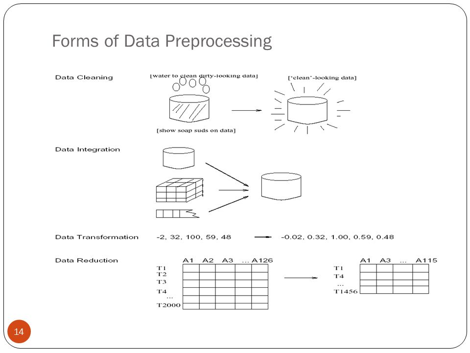

 # Table of Contents
<div class="toc" style="margin-top: 1em;"><ul class="toc-item" id="toc-level0"><li><span><a href="#数据预处理" data-toc-modified-id="数据预处理-1"><span class="toc-item-num">1&nbsp;&nbsp;</span>数据预处理</a></span><ul class="toc-item"><li><span><a href="#数据清洗" data-toc-modified-id="数据清洗-1.1"><span class="toc-item-num">1.1&nbsp;&nbsp;</span>数据清洗</a></span><ul class="toc-item"><li><span><a href="#缺失值" data-toc-modified-id="缺失值-1.1.1"><span class="toc-item-num">1.1.1&nbsp;&nbsp;</span>缺失值</a></span><ul class="toc-item"><li><span><a href="#忽略缺失值" data-toc-modified-id="忽略缺失值-1.1.1.1"><span class="toc-item-num">1.1.1.1&nbsp;&nbsp;</span>忽略缺失值</a></span></li><li><span><a href="#人工填写缺失值" data-toc-modified-id="人工填写缺失值-1.1.1.2"><span class="toc-item-num">1.1.1.2&nbsp;&nbsp;</span>人工填写缺失值</a></span></li><li><span><a href="#使用一个全局常量填充缺失值" data-toc-modified-id="使用一个全局常量填充缺失值-1.1.1.3"><span class="toc-item-num">1.1.1.3&nbsp;&nbsp;</span>使用一个全局常量填充缺失值</a></span></li><li><span><a href="#使用属性中心度填充缺失值" data-toc-modified-id="使用属性中心度填充缺失值-1.1.1.4"><span class="toc-item-num">1.1.1.4&nbsp;&nbsp;</span>使用属性中心度填充缺失值</a></span></li><li><span><a href="#使用最可能的值填充缺失值" data-toc-modified-id="使用最可能的值填充缺失值-1.1.1.5"><span class="toc-item-num">1.1.1.5&nbsp;&nbsp;</span>使用最可能的值填充缺失值</a></span></li></ul></li><li><span><a href="#噪声数据" data-toc-modified-id="噪声数据-1.1.2"><span class="toc-item-num">1.1.2&nbsp;&nbsp;</span>噪声数据</a></span><ul class="toc-item"><li><span><a href="#分箱（binning）" data-toc-modified-id="分箱（binning）-1.1.2.1"><span class="toc-item-num">1.1.2.1&nbsp;&nbsp;</span>分箱（binning）</a></span></li></ul></li></ul></li><li><span><a href="#数据集成" data-toc-modified-id="数据集成-1.2"><span class="toc-item-num">1.2&nbsp;&nbsp;</span>数据集成</a></span><ul class="toc-item"><li><span><a href="#冗余和相关性分析" data-toc-modified-id="冗余和相关性分析-1.2.1"><span class="toc-item-num">1.2.1&nbsp;&nbsp;</span>冗余和相关性分析</a></span><ul class="toc-item"><li><span><a href="#相关系数" data-toc-modified-id="相关系数-1.2.1.1"><span class="toc-item-num">1.2.1.1&nbsp;&nbsp;</span>相关系数</a></span></li></ul></li></ul></li><li><span><a href="#数据规范化" data-toc-modified-id="数据规范化-1.3"><span class="toc-item-num">1.3&nbsp;&nbsp;</span>数据规范化</a></span><ul class="toc-item"><li><span><a href="#最大最小规范化(min-max-scaled)" data-toc-modified-id="最大最小规范化(min-max-scaled)-1.3.1"><span class="toc-item-num">1.3.1&nbsp;&nbsp;</span>最大最小规范化(min-max scaled)</a></span></li><li><span><a href="#Z-score-规范化（零均值规范化）" data-toc-modified-id="Z-score-规范化（零均值规范化）-1.3.2"><span class="toc-item-num">1.3.2&nbsp;&nbsp;</span>Z-score 规范化（零均值规范化）</a></span></li><li><span><a href="#小数定标" data-toc-modified-id="小数定标-1.3.3"><span class="toc-item-num">1.3.3&nbsp;&nbsp;</span>小数定标</a></span></li></ul></li><li><span><a href="#习题" data-toc-modified-id="习题-1.4"><span class="toc-item-num">1.4&nbsp;&nbsp;</span>习题</a></span><ul class="toc-item"><li><span><a href="#习题3.3" data-toc-modified-id="习题3.3-1.4.1"><span class="toc-item-num">1.4.1&nbsp;&nbsp;</span>习题3.3</a></span></li><li><span><a href="#习题3.7" data-toc-modified-id="习题3.7-1.4.2"><span class="toc-item-num">1.4.2&nbsp;&nbsp;</span>习题3.7</a></span></li></ul></li></ul></li></ul></div>

# 数据预处理

现实的数据往往是充满噪声的，而没有高质量的数据，就没有高质量的数据挖掘结果。所以，我们需要对数据进行预处理，以提高数据的质量。

数据的质量涉及许多因素，包括：
- 准确性
- 完整性
- 一致性
- 时效性
- 可信性
- 可解释性

数据预处理的主要步骤为：
- 数据清理：通过填写缺失值、光滑噪声数据、识别或删除离群点。并解决不一致性来“清理”数据
- 数据集成：将多个数据源、数据库集成在一个
- 数据规约：将得到的数据进行简化，去除冗余数据
- 数据变换：讲数据进行规范化、数据离散化和数据分层，可以使得数据挖掘在多个抽象层次上进行。



## 数据清洗

现实中的数据一般是不完整的、有噪声的和不一致的。**数据清洗**试图填充缺失值、光滑噪声并识别离群点和纠正数据中的不一致。

### 缺失值
有时候我们获取的数据存在缺失值，这个往往用NaN来表示。


```python
import numpy as np
import pandas as pd

raw_data = {'first_name': ['Jason', np.nan, 'Tina', 'Jake', 'Amy'], 
        'last_name': ['Miller', np.nan, 'Ali', 'Milner', 'Cooze'], 
        'age': [42, np.nan, 36, 24, 73], 
        'sex': ['m', np.nan, 'f', 'm', 'f'], 
        'preTestScore': [4, np.nan, np.nan, 2, 3],
        'postTestScore': [25, np.nan, np.nan, 62, 70]}
df = pd.DataFrame(raw_data)
df
```


<div>
<table border="1" class="dataframe">
  <thead>
    <tr style="text-align: right;">
      <th></th>
      <th>age</th>
      <th>first_name</th>
      <th>last_name</th>
      <th>postTestScore</th>
      <th>preTestScore</th>
      <th>sex</th>
    </tr>
  </thead>
  <tbody>
    <tr>
      <th>0</th>
      <td>42.0</td>
      <td>Jason</td>
      <td>Miller</td>
      <td>25.0</td>
      <td>4.0</td>
      <td>m</td>
    </tr>
    <tr>
      <th>1</th>
      <td>NaN</td>
      <td>NaN</td>
      <td>NaN</td>
      <td>NaN</td>
      <td>NaN</td>
      <td>NaN</td>
    </tr>
    <tr>
      <th>2</th>
      <td>36.0</td>
      <td>Tina</td>
      <td>Ali</td>
      <td>NaN</td>
      <td>NaN</td>
      <td>f</td>
    </tr>
    <tr>
      <th>3</th>
      <td>24.0</td>
      <td>Jake</td>
      <td>Milner</td>
      <td>62.0</td>
      <td>2.0</td>
      <td>m</td>
    </tr>
    <tr>
      <th>4</th>
      <td>73.0</td>
      <td>Amy</td>
      <td>Cooze</td>
      <td>70.0</td>
      <td>3.0</td>
      <td>f</td>
    </tr>
  </tbody>
</table>
</div>


#### 忽略缺失值
当缺失值较少的时候，我们可以丢弃缺失的元组，而缺失值较多的时候，我们需要采取别的方法


```python
## 判断缺失值
df.isnull()
```


<div>
<table border="1" class="dataframe">
  <thead>
    <tr style="text-align: right;">
      <th></th>
      <th>age</th>
      <th>first_name</th>
      <th>last_name</th>
      <th>postTestScore</th>
      <th>preTestScore</th>
      <th>sex</th>
    </tr>
  </thead>
  <tbody>
    <tr>
      <th>0</th>
      <td>False</td>
      <td>False</td>
      <td>False</td>
      <td>False</td>
      <td>False</td>
      <td>False</td>
    </tr>
    <tr>
      <th>1</th>
      <td>True</td>
      <td>True</td>
      <td>True</td>
      <td>True</td>
      <td>True</td>
      <td>True</td>
    </tr>
    <tr>
      <th>2</th>
      <td>False</td>
      <td>False</td>
      <td>False</td>
      <td>True</td>
      <td>True</td>
      <td>False</td>
    </tr>
    <tr>
      <th>3</th>
      <td>False</td>
      <td>False</td>
      <td>False</td>
      <td>False</td>
      <td>False</td>
      <td>False</td>
    </tr>
    <tr>
      <th>4</th>
      <td>False</td>
      <td>False</td>
      <td>False</td>
      <td>False</td>
      <td>False</td>
      <td>False</td>
    </tr>
  </tbody>
</table>
</div>


```python
## 删除缺失值所在的元组（行）
df.dropna(axis=0)
```


<div>
<table border="1" class="dataframe">
  <thead>
    <tr style="text-align: right;">
      <th></th>
      <th>age</th>
      <th>first_name</th>
      <th>last_name</th>
      <th>postTestScore</th>
      <th>preTestScore</th>
      <th>sex</th>
    </tr>
  </thead>
  <tbody>
    <tr>
      <th>0</th>
      <td>42.0</td>
      <td>Jason</td>
      <td>Miller</td>
      <td>25.0</td>
      <td>4.0</td>
      <td>m</td>
    </tr>
    <tr>
      <th>3</th>
      <td>24.0</td>
      <td>Jake</td>
      <td>Milner</td>
      <td>62.0</td>
      <td>2.0</td>
      <td>m</td>
    </tr>
    <tr>
      <th>4</th>
      <td>73.0</td>
      <td>Amy</td>
      <td>Cooze</td>
      <td>70.0</td>
      <td>3.0</td>
      <td>f</td>
    </tr>
  </tbody>
</table>
</div>


#### 人工填写缺失值
该方法对少数缺失值有效，但费时，且当数据非常大时难以实现


```python
## 将序号 1 的年龄填写为30
df_manual = df.copy()
df_manual.loc[1,'age'] = 30
df_manual
```


<div>
<table border="1" class="dataframe">
  <thead>
    <tr style="text-align: right;">
      <th></th>
      <th>age</th>
      <th>first_name</th>
      <th>last_name</th>
      <th>postTestScore</th>
      <th>preTestScore</th>
      <th>sex</th>
    </tr>
  </thead>
  <tbody>
    <tr>
      <th>0</th>
      <td>42.0</td>
      <td>Jason</td>
      <td>Miller</td>
      <td>25.0</td>
      <td>4.0</td>
      <td>m</td>
    </tr>
    <tr>
      <th>1</th>
      <td>30.0</td>
      <td>NaN</td>
      <td>NaN</td>
      <td>NaN</td>
      <td>NaN</td>
      <td>NaN</td>
    </tr>
    <tr>
      <th>2</th>
      <td>36.0</td>
      <td>Tina</td>
      <td>Ali</td>
      <td>NaN</td>
      <td>NaN</td>
      <td>f</td>
    </tr>
    <tr>
      <th>3</th>
      <td>24.0</td>
      <td>Jake</td>
      <td>Milner</td>
      <td>62.0</td>
      <td>2.0</td>
      <td>m</td>
    </tr>
    <tr>
      <th>4</th>
      <td>73.0</td>
      <td>Amy</td>
      <td>Cooze</td>
      <td>70.0</td>
      <td>3.0</td>
      <td>f</td>
    </tr>
  </tbody>
</table>
</div>


#### 使用一个全局常量填充缺失值


```python
## 用999填充缺失值
df.fillna(value=999)
```


<div>
<table border="1" class="dataframe">
  <thead>
    <tr style="text-align: right;">
      <th></th>
      <th>age</th>
      <th>first_name</th>
      <th>last_name</th>
      <th>postTestScore</th>
      <th>preTestScore</th>
      <th>sex</th>
    </tr>
  </thead>
  <tbody>
    <tr>
      <th>0</th>
      <td>42.0</td>
      <td>Jason</td>
      <td>Miller</td>
      <td>25.0</td>
      <td>4.0</td>
      <td>m</td>
    </tr>
    <tr>
      <th>1</th>
      <td>999.0</td>
      <td>999</td>
      <td>999</td>
      <td>999.0</td>
      <td>999.0</td>
      <td>999</td>
    </tr>
    <tr>
      <th>2</th>
      <td>36.0</td>
      <td>Tina</td>
      <td>Ali</td>
      <td>999.0</td>
      <td>999.0</td>
      <td>f</td>
    </tr>
    <tr>
      <th>3</th>
      <td>24.0</td>
      <td>Jake</td>
      <td>Milner</td>
      <td>62.0</td>
      <td>2.0</td>
      <td>m</td>
    </tr>
    <tr>
      <th>4</th>
      <td>73.0</td>
      <td>Amy</td>
      <td>Cooze</td>
      <td>70.0</td>
      <td>3.0</td>
      <td>f</td>
    </tr>
  </tbody>
</table>
</div>


#### 使用属性中心度填充缺失值


```python
## 给定元组均值
df.fillna(value=df.mean())
```


<div>
<table border="1" class="dataframe">
  <thead>
    <tr style="text-align: right;">
      <th></th>
      <th>age</th>
      <th>first_name</th>
      <th>last_name</th>
      <th>postTestScore</th>
      <th>preTestScore</th>
      <th>sex</th>
    </tr>
  </thead>
  <tbody>
    <tr>
      <th>0</th>
      <td>42.00</td>
      <td>Jason</td>
      <td>Miller</td>
      <td>25.000000</td>
      <td>4.0</td>
      <td>m</td>
    </tr>
    <tr>
      <th>1</th>
      <td>43.75</td>
      <td>NaN</td>
      <td>NaN</td>
      <td>52.333333</td>
      <td>3.0</td>
      <td>NaN</td>
    </tr>
    <tr>
      <th>2</th>
      <td>36.00</td>
      <td>Tina</td>
      <td>Ali</td>
      <td>52.333333</td>
      <td>3.0</td>
      <td>f</td>
    </tr>
    <tr>
      <th>3</th>
      <td>24.00</td>
      <td>Jake</td>
      <td>Milner</td>
      <td>62.000000</td>
      <td>2.0</td>
      <td>m</td>
    </tr>
    <tr>
      <th>4</th>
      <td>73.00</td>
      <td>Amy</td>
      <td>Cooze</td>
      <td>70.000000</td>
      <td>3.0</td>
      <td>f</td>
    </tr>
  </tbody>
</table>
</div>


#### 使用最可能的值填充缺失值
可使用是回归、贝叶斯等方法确定最可能的值。也可以使用插值法填充。


```python
## 使用上一个值替代
df.fillna(method='ffill')
```


<div>
<table border="1" class="dataframe">
  <thead>
    <tr style="text-align: right;">
      <th></th>
      <th>age</th>
      <th>first_name</th>
      <th>last_name</th>
      <th>postTestScore</th>
      <th>preTestScore</th>
      <th>sex</th>
    </tr>
  </thead>
  <tbody>
    <tr>
      <th>0</th>
      <td>42.0</td>
      <td>Jason</td>
      <td>Miller</td>
      <td>25.0</td>
      <td>4.0</td>
      <td>m</td>
    </tr>
    <tr>
      <th>1</th>
      <td>42.0</td>
      <td>Jason</td>
      <td>Miller</td>
      <td>25.0</td>
      <td>4.0</td>
      <td>m</td>
    </tr>
    <tr>
      <th>2</th>
      <td>36.0</td>
      <td>Tina</td>
      <td>Ali</td>
      <td>25.0</td>
      <td>4.0</td>
      <td>f</td>
    </tr>
    <tr>
      <th>3</th>
      <td>24.0</td>
      <td>Jake</td>
      <td>Milner</td>
      <td>62.0</td>
      <td>2.0</td>
      <td>m</td>
    </tr>
    <tr>
      <th>4</th>
      <td>73.0</td>
      <td>Amy</td>
      <td>Cooze</td>
      <td>70.0</td>
      <td>3.0</td>
      <td>f</td>
    </tr>
  </tbody>
</table>
</div>


```python
##使用线性插值法填充
df.interpolate()
```


<div>
<table border="1" class="dataframe">
  <thead>
    <tr style="text-align: right;">
      <th></th>
      <th>age</th>
      <th>first_name</th>
      <th>last_name</th>
      <th>postTestScore</th>
      <th>preTestScore</th>
      <th>sex</th>
    </tr>
  </thead>
  <tbody>
    <tr>
      <th>0</th>
      <td>42.0</td>
      <td>Jason</td>
      <td>Miller</td>
      <td>25.000000</td>
      <td>4.000000</td>
      <td>m</td>
    </tr>
    <tr>
      <th>1</th>
      <td>39.0</td>
      <td>NaN</td>
      <td>NaN</td>
      <td>37.333333</td>
      <td>3.333333</td>
      <td>NaN</td>
    </tr>
    <tr>
      <th>2</th>
      <td>36.0</td>
      <td>Tina</td>
      <td>Ali</td>
      <td>49.666667</td>
      <td>2.666667</td>
      <td>f</td>
    </tr>
    <tr>
      <th>3</th>
      <td>24.0</td>
      <td>Jake</td>
      <td>Milner</td>
      <td>62.000000</td>
      <td>2.000000</td>
      <td>m</td>
    </tr>
    <tr>
      <th>4</th>
      <td>73.0</td>
      <td>Amy</td>
      <td>Cooze</td>
      <td>70.000000</td>
      <td>3.000000</td>
      <td>f</td>
    </tr>
  </tbody>
</table>
</div>


### 噪声数据
噪声（noise）是被测量的变量的随机误差或方差。

#### 分箱（binning）
分箱通过查考数据的“临近”即周围值来光滑有序数据值。由于分箱方法考察邻近值，因此它进行的是局部光滑。

将数据分为$n$个等频的箱中，可以用**箱均值**、**箱中位数**或**箱边界**光滑数据。


```python
data_price = np.array([15,4,8,21,28,21,24,25,34])
data_price
```


    array([15,  4,  8, 21, 28, 21, 24, 25, 34])


```python
## 对数据进行排序
data_price.sort()
data_price
```


    array([ 4,  8, 15, 21, 21, 24, 25, 28, 34])


```python
## 将数据进行分箱， 分3个箱
data_box = data_price.reshape([3,-1])
data_box
```


    array([[ 4,  8, 15],
           [21, 21, 24],
           [25, 28, 34]])


```python
## 用箱均值光滑
np.repeat(data_box.mean(axis=1), 3)
```


    array([  9.,   9.,   9.,  22.,  22.,  22.,  29.,  29.,  29.])


```python
## 用箱中位数光滑
np.repeat(np.median(data_box, axis=1), 3)
```


    array([  8.,   8.,   8.,  21.,  21.,  21.,  28.,  28.,  28.])


```python
from scipy import stats
values = [1.0, 1.0, 2.0, 1.5, 3.0]
stats.binned_statistic([1, 1, 2, 5, 7], values, 'mean', bins=3)
```


    BinnedStatisticResult(statistic=array([ 1.33333333,         nan,  2.25      ]), bin_edges=array([ 1.,  3.,  5.,  7.]), binnumber=array([1, 1, 1, 3, 3]))


```python
## 用箱边界光滑
np.repeat(data_box.max(axis=1), 3)
```


    array([15, 15, 15, 24, 24, 24, 34, 34, 34])


## 数据集成
数据挖掘经常需要合并来自多个数据存储的数据。而合并的数据往往容易产生冗余。

### 冗余和相关性分析
一个属性如果能有另一组属性“导出”，则这个属性可能是冗余的。属性或维度命名不一致也可能导致数据集冗余。

有些冗余可以被**相关分析**检测到。

#### 相关系数


```python
data_corr = np.array([[6,5,4,3,2,],[20,10,14,5,5,]])
data_corr
```


    array([[ 6,  5,  4,  3,  2],
           [20, 10, 14,  5,  5]])


```python
np.corrcoef(data_corr)
```


    array([[ 1.        ,  0.86744279],
           [ 0.86744279,  1.        ]])


## 数据规范化

### 最大最小规范化(min-max scaled)
假设 $min_A$ 和 $max_{A} $ 分别是属性 $A$ 的最小值和最大值，计算公式如下：

$$ v_{i}^{'}  = \frac{v_i - \min_A}{\max_A - \min_A}(new_{maxA} - new_{minA}) + new_{minA} \tag{1} $$

这样就把 $A$ 的值映射到区间 $[new_{maxA} ,new_{minA}]$ 中的 $v_{i}^{'}$ 中。


```python
## min-max scale
from sklearn import preprocessing
X_train = np.array([[ 1., -1.,  2.],
                   [ 2.,  0.,  0.],
                   [ 0.,  1., -1.]])
min_max_scaler = preprocessing.MinMaxScaler()
X_train_minmax = min_max_scaler.fit_transform(X_train)
X_train_minmax
```


    array([[ 0.5       ,  0.        ,  1.        ],
           [ 1.        ,  0.5       ,  0.33333333],
           [ 0.        ,  1.        ,  0.        ]])


### Z-score 规范化（零均值规范化）

$$ v_{i}^{'}  = \frac{v_i - \bar{A}}{\sigma_A}   \tag{2} $$

通过z-socre规范化，将数值的均值转换成0， 方差转换成1


```python
X_scaled = preprocessing.scale(X_train)
X_scaled
```


    array([[ 0.        , -1.22474487,  1.33630621],
           [ 1.22474487,  0.        , -0.26726124],
           [-1.22474487,  1.22474487, -1.06904497]])


```python
X_scaled.mean()
```


    4.9343245538895844e-17


```python
X_scaled.var()
```


    1.0


### 小数定标
通过移动属性 $A$的小数点位置来进行规范化:

$$ v_{i}^{'}  = \frac{v_i}{10^j}   \tag{3} $$

其中 $j$ 是使得 $max(\left|v^{'}_i \right|) < 1$ 的最小整数


```python
X_train / 10
```


    array([[ 0.1, -0.1,  0.2],
           [ 0.2,  0. ,  0. ],
           [ 0. ,  0.1, -0.1]])


## 习题

### 习题3.3
对数据 13,15,16,16,19,20,20,21,22,22,25,25,25,25,30,33,33,35,35,35,35,36,40,45,46,52,70 使用深度为 3 的箱，用箱均值光滑数据。


```python
data = np.array([13,15,16,16,19,20,20,21,22,22,25,25,25,25,30,33,33,35,35,35,35,36,40,45,46,52,70])
data
```


    array([13, 15, 16, 16, 19, 20, 20, 21, 22, 22, 25, 25, 25, 25, 30, 33, 33,
           35, 35, 35, 35, 36, 40, 45, 46, 52, 70])


```python
np.repeat(data.reshape([-1, 3]).mean(axis=1), 3)
```


    array([ 14.66666667,  14.66666667,  14.66666667,  18.33333333,
            18.33333333,  18.33333333,  21.        ,  21.        ,
            21.        ,  24.        ,  24.        ,  24.        ,
            26.66666667,  26.66666667,  26.66666667,  33.66666667,
            33.66666667,  33.66666667,  35.        ,  35.        ,
            35.        ,  40.33333333,  40.33333333,  40.33333333,
            56.        ,  56.        ,  56.        ])


### 习题3.7
根据习题 3.3 的数据
- 使用最小-最大规范化将 35 映射到 $[0,1]$ 区间
- 使用z分数规范化变化 35
- 使用小数定标规范化变换 35


```python
# min-max
(35 - data.min()) / (data.max() - data.min())
```


    0.38596491228070173


```python
## z-score
(35 - data.mean()) / data.std()
```


    0.39661103485373522


```python
## decimal 
35 / 100
```


    0.35


