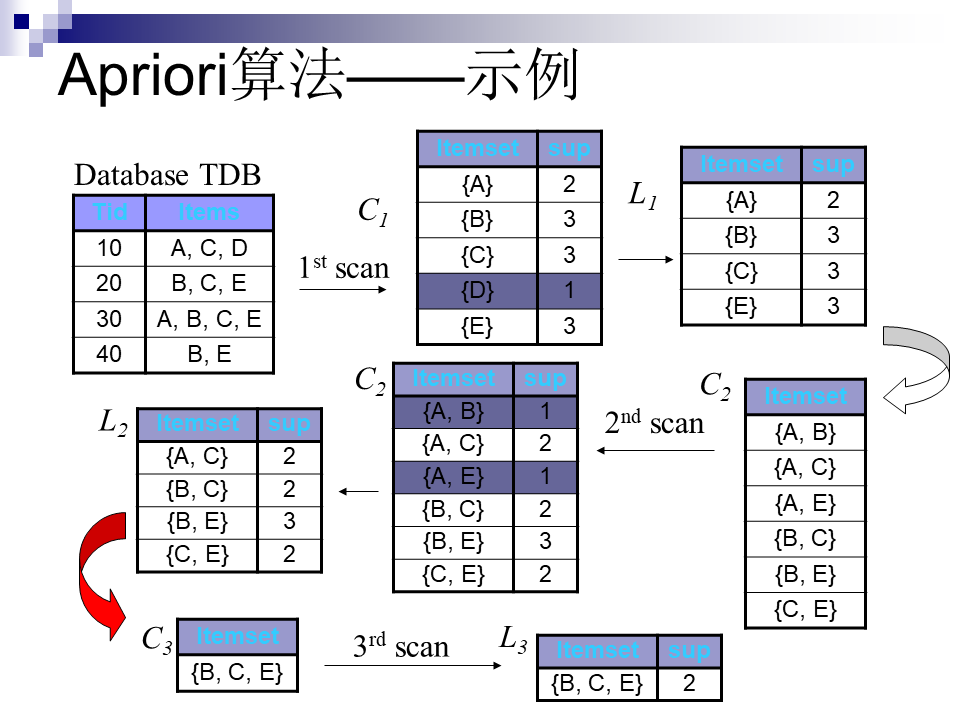

# 关联规则

关联规则挖掘是指从事务数据库，关系数据库和其他信息存储中的大量数据的项集之间发现有趣的、频繁出现的模式、关联和相关性。关联规则被广泛应用在购物篮分析、分类设计、捆绑销售和亏本销售分析之中。

## 基本概念
给定：
- 项的集合： $I=\left \{i_1,i_2,...,i_n\right \}$
- 任务相关数据 $D $是数据库事务的集合，每个事务 $T $则是项的集合，使得 $T \subseteq I$
- 每个事务由事务标识符 $TID$ 标识；
- $A,B$ 为两个项集，事务 $T$ 包含 $A$ 当且仅当 $A \subseteq T$

则关联规则是如下蕴涵式：

$$ A \Rightarrow  B [s,c]  \tag{1}$$

其中 $A \subseteq I, B\subseteq I$ 并且 $A \bigcap B = \varnothing $  ，规则 $A \Rightarrow B$ 在事务集 $D$ 中成立，并且具有支持度 $s$ 和置信度 $c$ 。


### 规则度量：支持度和置信度

对所有满足最小支持度和置信度的关联规则：
 - 支持度 $s$ 是指事务集 $D$ 中包含 $ A\cup B$ 的百分比: 
 
 $$ support( A \Rightarrow B) = P(A \cup B) \tag{2} $$
 
 - 置信度 $c$ 是指 $D$ 中包含 $A$ 的事务同时也包含 $B$ 的百分比：
 
 $$ confidence( A \Rightarrow B) = P(B|A) = \frac{P(A \cup B)}{P(A)} \tag{3} $$


如：

|  TID | 购买的item |
|:----:|:----------|
| 2000 |    A,B,C   |
| 1000 |     A,C    |
| 4000 |     A,D    |
| 5000 |    B,E,F   |

则 $A$ 与 $C$ 的关联规则 为：
- $A \Rightarrow  C(50\%, 66.6\%)$
- $C \Rightarrow  A(50\%, 100\%)$


## 关联规则挖掘

### 基本概念

- $k－项集$：包含 $k$ 个项的集合
    - {牛奶，面包，黄油} 是个$3－项集$
- 项集的频率是指包含项集的事务数
- 如果项集的频率大于（最小支持度 $×$ $D$中的事务总数），则称该项集为 **频繁项集** 


### 关联规则挖掘包含两个过程：
- 找出所有频繁项集
    - 大部分的计算都集中在这一步
- 由频繁项集产生强关联规则
    - 即满足最小支持度和最小置信度的规则


### Apriori 算法

#### Apriori 算法基本知识

Apriori是关联规则模型中的经典算法。它算法利用频繁项集性质的先验知识（prior knowledge），通过逐层搜索的迭代方法，即将 $k-项集$ 用于探察 $(k+1)-项集$ ，来穷尽数据集中的所有频繁项集。
> 先找到频繁 $1-项集$ 集合 $L_1$ ,然后用 $L_1$ 找到频繁 $2-项集$ 集合 $L_2$ ，接着用 $L_2$找 $L_3$ ，直到找不到频繁 $k-项集$ ，找每个 $L_k$ 需要一次数据库扫描。

Apriori性质：**频繁项集的所有非空子集也必须是频繁的。（ $A \cup B$ 模式不可能比 $A$ 更频繁的出现）**

> Apriori算法是反单调的，即一个集合如果不能通过测试，则该集合的所有超集也不能通过相同的测试。

#### Apriori算法步骤
Apriori算法由连接和剪枝两个步骤组成。

 - **连接**：为了找 $L_k$，通过 $L_{k-1}$ 与自己连接产生候选 $k-项集$ 的集合，该候选 $k$ 项集记为 $C_k$。
    - $L_{k-1}$ 中的两个元素 $L_1$ 和 $L_2$ 可以执行连接操作 $l_1 \triangleright  \triangleleft l_2$ 的条件是：
         $$ (l_1[1] = l_2[1]) \wedge (l_1[2] = l_2[2]) \wedge \dots \wedge (l_1[k-2] = l_2[k-2]) \wedge (l_1[k-1] = l_2[k-1]) \tag{4}$$
         
         
 - **剪枝**： $C_k$ 是 $L_k$ 的超集，即它的成员可能不是频繁的，但是所有频繁的 $k-项集$ 都在 $C_k$ 中。因此可以通过扫描数据库，通过计算每个 $k-项集$ 的支持度来得到 $L_k$ 。
> 为了减少计算量，可以使用 Apriori 性质，即如果一个 $k-项集$ 的 $(k-1)-子集$ 不在 $L_{k-1}$ 中，则该候选不可能是频繁的，可以直接从 $C_{k}$ 删除。

#### Apriori算法示例：


##### 使用Apiori性质由L2产生C3
 1. 连接：C3=L2 $\triangleright \triangleleft$ L2 =[{A,C},{B,C},{B,E}{C,E}] $\triangleright \triangleleft$ [{A,C},{B,C},{B,E}{C,E}] = [{A,B,C},{A,C,E},{B,C,E}]
 2. 使用Apriori性质剪枝：频繁项集的所有子集必须是频繁的，对候选项C3，我们可以删除其子集为非频繁的选项：
    - {A,B,C}的2项子集是{A,B},{A,C},{B,C}，其中{A,B}不是L2的元素，所以删除这个选项；
    - {A,C,E}的2项子集是{A,C},{A,E},{C,E}，其中{A,E} 不是L2的元素，所以删除这个选项；
    - {B,C,E}的2项子集是{B,C},{B,E},{C,E}，它的所有2－项子集都是L2的元素，因此保留这个选项。
 3. 这样，剪枝后得到C3=[{B,C,E}]


#### 由频繁项集产生关联规则

同时满足最小支持度和最小置信度的才是强关联规则，从频繁项集产生的规则都满足支持度要求，而其置信度则可由一下公式计算：

$$ confidence(A \Rightarrow B) = P(B|A) = \frac{support_{count}(A\cup B)}{support_{count}(A)} \tag{5} $$

每个关联规则可由如下过程产生： 
 - 对于每个频繁项集 $l$，产生 $l$ 的所有非空子集
 
 
 - 对于每个非空子集 $s$，如果 $\frac{support_{count} (A\cup B)}{support_{count}(A)} > min_{conf}$ 则输出规则： $s \Rightarrow (l-s)$ 


### Apriori 算法调用


```python
from apyori import apriori ##需要安装 pip install apyori
## test 1:
data1 = [['l1', 'l2', 'l5'], ['l2', 'l4'], ['l2', 'l3'],
        ['l1', 'l2', 'l4'], ['l1', 'l3'], ['l2', 'l3'],
        ['l1', 'l3'], ['l1', 'l2', 'l3', 'l5'], ['l1', 'l2', 'l3']]

min_support = 0.22
min_confidence = 0.7

list(apriori(data1, min_support=min_support, min_confidence=min_confidence))
```


    [RelationRecord(items=frozenset({'l2'}), support=0.7777777777777778, ordered_statistics=[OrderedStatistic(items_base=frozenset(), items_add=frozenset({'l2'}), confidence=0.7777777777777778, lift=1.0)]),
     RelationRecord(items=frozenset({'l5', 'l1'}), support=0.2222222222222222, ordered_statistics=[OrderedStatistic(items_base=frozenset({'l5'}), items_add=frozenset({'l1'}), confidence=1.0, lift=1.5)]),
     RelationRecord(items=frozenset({'l4', 'l2'}), support=0.2222222222222222, ordered_statistics=[OrderedStatistic(items_base=frozenset({'l4'}), items_add=frozenset({'l2'}), confidence=1.0, lift=1.2857142857142856)]),
     RelationRecord(items=frozenset({'l5', 'l2'}), support=0.2222222222222222, ordered_statistics=[OrderedStatistic(items_base=frozenset({'l5'}), items_add=frozenset({'l2'}), confidence=1.0, lift=1.2857142857142856)]),
     RelationRecord(items=frozenset({'l5', 'l2', 'l1'}), support=0.2222222222222222, ordered_statistics=[OrderedStatistic(items_base=frozenset({'l5', 'l1'}), items_add=frozenset({'l2'}), confidence=1.0, lift=1.2857142857142856), OrderedStatistic(items_base=frozenset({'l5', 'l2'}), items_add=frozenset({'l1'}), confidence=1.0, lift=1.5)])]


```python
data2 = [['m', 'o', 'n', 'k', 'e', 'y' ],
    ['d', 'o', 'n', 'k', 'e', 'y' ],
    ['m', 'a', 'k', 'e','',''],
    ['m', 'u', 'c', 'k', 'y',''],
    ['c', 'o', 'o', 'k', 'i', 'e']]
data2
```


    [['m', 'o', 'n', 'k', 'e', 'y'],
     ['d', 'o', 'n', 'k', 'e', 'y'],
     ['m', 'a', 'k', 'e', '', ''],
     ['m', 'u', 'c', 'k', 'y', ''],
     ['c', 'o', 'o', 'k', 'i', 'e']]


```python
list(apriori(data2, min_support=0.6, min_confidence=0.8))
```


    [RelationRecord(items=frozenset({'e'}), support=0.8, ordered_statistics=[OrderedStatistic(items_base=frozenset(), items_add=frozenset({'e'}), confidence=0.8, lift=1.0)]),
     RelationRecord(items=frozenset({'k'}), support=1.0, ordered_statistics=[OrderedStatistic(items_base=frozenset(), items_add=frozenset({'k'}), confidence=1.0, lift=1.0)]),
     RelationRecord(items=frozenset({'e', 'k'}), support=0.8, ordered_statistics=[OrderedStatistic(items_base=frozenset({'e'}), items_add=frozenset({'k'}), confidence=1.0, lift=1.0), OrderedStatistic(items_base=frozenset({'k'}), items_add=frozenset({'e'}), confidence=0.8, lift=1.0)]),
     RelationRecord(items=frozenset({'e', 'o'}), support=0.6, ordered_statistics=[OrderedStatistic(items_base=frozenset({'o'}), items_add=frozenset({'e'}), confidence=1.0, lift=1.25)]),
     RelationRecord(items=frozenset({'k', 'm'}), support=0.6, ordered_statistics=[OrderedStatistic(items_base=frozenset({'m'}), items_add=frozenset({'k'}), confidence=1.0, lift=1.0)]),
     RelationRecord(items=frozenset({'k', 'o'}), support=0.6, ordered_statistics=[OrderedStatistic(items_base=frozenset({'o'}), items_add=frozenset({'k'}), confidence=1.0, lift=1.0)]),
     RelationRecord(items=frozenset({'k', 'y'}), support=0.6, ordered_statistics=[OrderedStatistic(items_base=frozenset({'y'}), items_add=frozenset({'k'}), confidence=1.0, lift=1.0)]),
     RelationRecord(items=frozenset({'e', 'o', 'k'}), support=0.6, ordered_statistics=[OrderedStatistic(items_base=frozenset({'e', 'o'}), items_add=frozenset({'k'}), confidence=1.0, lift=1.0), OrderedStatistic(items_base=frozenset({'k', 'o'}), items_add=frozenset({'e'}), confidence=1.0, lift=1.25)])]


### Apriori 算法实现（选读）

#### 每部分函数定义


```python
min_support = 0.22
data_set = [['l1', 'l2', 'l5'], ['l2', 'l4'], ['l2', 'l3'],
        ['l1', 'l2', 'l4'], ['l1', 'l3'], ['l2', 'l3'],
        ['l1', 'l3'], ['l1', 'l2', 'l3', 'l5'], ['l1', 'l2', 'l3']]
data_set
```


    [['l1', 'l2', 'l5'],
     ['l2', 'l4'],
     ['l2', 'l3'],
     ['l1', 'l2', 'l4'],
     ['l1', 'l3'],
     ['l2', 'l3'],
     ['l1', 'l3'],
     ['l1', 'l2', 'l3', 'l5'],
     ['l1', 'l2', 'l3']]


```python
## 记录得到包含的元素
data_list = set(item for data in data_set for item in data)
data_list
```


    {'l1', 'l2', 'l3', 'l4', 'l5'}


```python
C = {}
L = {}
L_rule = {}
items = {}
num = len(data_set)
min_s = min_support * num
```

##### 用于计算C


```python
import itertools
def get_c(data_set, data_list, i, items, C):
    ## 将每个item 当成字典，存在 items中
    items['item_' + str(i)] = set(itertools.combinations(data_list,i))
    C['C_'+str(i)] = {}  
    ## 对每个item 计算含有的个数，即support       
    for item in items['item_' + str(i)]:
        s = 0
        for data in data_set:
            ## 判断 元素是否存在 item 中，如果在则 +1
            if set(item).issubset(data):
                s += 1 
        C['C_'+str(i)][item] = s
    return C
```


```python
C = get_c(data_set, data_list, 1, items, C)
C = get_c(data_set, data_list, 2, items, C)
C
```


    {'C_1': {('l1',): 6, ('l2',): 7, ('l3',): 6, ('l4',): 2, ('l5',): 2},
     'C_2': {('l2', 'l1'): 4,
      ('l2', 'l4'): 2,
      ('l3', 'l1'): 4,
      ('l3', 'l2'): 4,
      ('l3', 'l4'): 0,
      ('l3', 'l5'): 1,
      ('l4', 'l1'): 1,
      ('l5', 'l1'): 2,
      ('l5', 'l2'): 2,
      ('l5', 'l4'): 0}}


##### 用于计算L


```python
def get_l(L, C, i, min_s):
    L['L_'+str(i)] = {}
    ## 对c中的每个item 判断是否大于最小的支持个数，大于的存在L中
    for item in C['C_'+str(i)]:
        if C['C_'+str(i)][item] >= min_s:
            L['L_'+str(i)][item] = C['C_'+str(i)][item]
    return L
```


```python
L = get_l(L, C, i=1, min_s=min_s)
L = get_l(L, C, i=2, min_s=min_s)
L
```


    {'L_1': {('l1',): 6, ('l2',): 7, ('l3',): 6, ('l4',): 2, ('l5',): 2},
     'L_2': {('l2', 'l1'): 4,
      ('l2', 'l4'): 2,
      ('l3', 'l1'): 4,
      ('l3', 'l2'): 4,
      ('l5', 'l1'): 2,
      ('l5', 'l2'): 2}}


##### 用于计算强相关规则


```python
def get_relu(L_rule, L, i, num):
    L_rule['L_'+str(i)] = []
    ## 遍历频繁项级 L 中的每个元素
    for m in L['L_'+str(i)]:
        for n in range(1,i):
            # 分别对每个元素进行组合
            for j in itertools.combinations(m,n):
                A = j
                B = set(m) - set(A)      ## B 为 A 在 L 中的补集 

                ## 分别计算 A 在频繁项级中的个数 和 B 在频繁项级中的个数
                A_num = L['L_'+str(len(A))].get(tuple(A)) 
                B_num = L['L_'+str(len(m))][m]

                ## 计算置信度和支持度
                support = A_num / num 
                confidence = B_num / A_num  ## 根据公式(5)计算置信度

                ## 判断是置信度知否大于最小置信度
                if confidence >= min_confidence:
                    L_rule['L_'+str(i)].append([set(A) , B, str(round(support, 2)), str(round(confidence, 2))])
    return L_rule
```


```python
L_rule = get_relu(L_rule,L, 2, num)
L_rule
```


    {'L_2': [[{'l4'}, {'l2'}, '0.22', '1.0'],
      [{'l5'}, {'l1'}, '0.22', '1.0'],
      [{'l5'}, {'l2'}, '0.22', '1.0']]}


##### 打印强关联规则


```python
def print_rule(L_rule):
    for key, value in L_rule.items():
        print(key)
        for item in value:
            print(item[0] , '==>' , item[1], end='\t\t')
            print('support: %.2f' %float(item[2]), end='\t\t')
            print('confidence: %.2f' %float(item[3]))
        print()
```


```python
print_rule(L_rule=L_rule)
```

    L_2
    {'l4'} ==> {'l2'}		support: 0.22		confidence: 1.00
    {'l5'} ==> {'l1'}		support: 0.22		confidence: 1.00
    {'l5'} ==> {'l2'}		support: 0.22		confidence: 1.00
    
    

##### 总的 Apriori 算法


```python
def apriori(data_set, min_support, min_confidence,print_result=False):
    
    num = len(data_set)
    min_s = min_support * num   
    
    items = {}
    C = {}
    L = {}
    L_rule = {}
    
    data_list = set(item for data in data_set for item in data)
    
    for i in range(1, num+1):
        C = get_c(data_set, data_list, i, items, C)
        L = get_l(L, C, i, min_s=min_s)
        
        ## 用于终止频繁项集的迭代
        if not L['L_'+str(i)]:
            break
            
        L_rule = get_relu(L_rule,L, i, num)
    
    L_rule.pop('L_1')
    if print_result:
        print_rule(L_rule)

    
    return L_rule, L
```


```python
## test 1:
data = [['l1', 'l2', 'l5'], ['l2', 'l4'], ['l2', 'l3'],
        ['l1', 'l2', 'l4'], ['l1', 'l3'], ['l2', 'l3'],
        ['l1', 'l3'], ['l1', 'l2', 'l3', 'l5'], ['l1', 'l2', 'l3']]

min_support = 0.22
min_confidence = 0.7
rule, l = apriori(data, min_support, min_confidence, print_result=True)
```

    L_2
    {'l4'} ==> {'l2'}		support: 0.22		confidence: 1.00
    {'l5'} ==> {'l1'}		support: 0.22		confidence: 1.00
    {'l5'} ==> {'l2'}		support: 0.22		confidence: 1.00
    
    L_3
    {'l5'} ==> {'l2', 'l1'}		support: 0.22		confidence: 1.00
    {'l5', 'l2'} ==> {'l1'}		support: 0.22		confidence: 1.00
    {'l5', 'l1'} ==> {'l2'}		support: 0.22		confidence: 1.00
    
    


```python
## test 2:
data_set = ['monkey','donkey', 'make', 'mucky', 'cookie']
data = [[_ for _ in d] for d in data_set]
min_support = 0.6
min_confidence = 0.8

rule, l = apriori(data, min_support, min_confidence, print_result=True)
```

    L_2
    {'o'} ==> {'e'}		support: 0.60		confidence: 1.00
    {'y'} ==> {'k'}		support: 0.60		confidence: 1.00
    {'o'} ==> {'k'}		support: 0.60		confidence: 1.00
    {'k'} ==> {'e'}		support: 1.00		confidence: 0.80
    {'e'} ==> {'k'}		support: 0.80		confidence: 1.00
    {'m'} ==> {'k'}		support: 0.60		confidence: 1.00
    
    L_3
    {'o'} ==> {'k', 'e'}		support: 0.60		confidence: 1.00
    {'k', 'o'} ==> {'e'}		support: 0.60		confidence: 1.00
    {'e', 'o'} ==> {'k'}		support: 0.60		confidence: 1.00
    
    

#### Apriori 算法整合


```python
class Apriori():
    
    def __init__(self):
        self.items = {}
        self.C = {}
        self.L = {}
        self.L_rule = {}
    
    import itertools
    def get_c(self, i):
        ## 将每个item 当成字典，存在 items中
        self.items['item_' + str(i)] = set(itertools.combinations(self.data_list,i))
        self.C['C_'+str(i)] = {}  
        ## 对每个item 计算含有的个数，即support       
        for item in self.items['item_' + str(i)]:
            s = 0
            for data in self.data_set:
                ## 判断 元素是否存在 item 中，如果在则 +1
                if set(item).issubset(data):
                    s += 1 
            self.C['C_'+str(i)][item] = s
            
    def get_l(self, i):
        self.L['L_'+str(i)] = {}
        ## 对c中的每个item 判断是否大于最小的支持个数，大于的存在L中
        for item in self.C['C_'+str(i)]:
            if self.C['C_'+str(i)][item] >= self.min_s:
                self.L['L_'+str(i)][item] = self.C['C_'+str(i)][item]
                
    def get_relu(self, i):
        self.L_rule['L_'+str(i)] = []
        ## 遍历频繁项级 L 中的每个元素
        for m in self.L['L_'+str(i)]:
            for n in range(1,i):
                # 分别对每个元素进行组合
                for j in itertools.combinations(m,n):
                    A = j
                    B = set(m) - set(A)      ## B 为 A 在 L 中的补集 

                    ## 分别计算 A 在频繁项级中的个数 和 B 在频繁项级中的个数
                    A_num = self.L['L_'+str(len(A))].get(tuple(A)) 
                    B_num = self.L['L_'+str(len(m))][m]

                    ## 计算置信度和支持度
                    support = A_num / num 
                    confidence = B_num / A_num  ## 根据公式(5)计算置信度

                    ## 判断是置信度知否大于最小置信度
                    if confidence >= self.min_confidence:
                        self.L_rule['L_'+str(i)].append([set(A) , B, str(round(support, 2)), str(round(confidence, 2))])

    def print_rule(self):
        for key, value in self.L_rule.items():
            print(key)
            for item in value:
                print(item[0] , '==>' , item[1], end='\t\t')
                print('support: %.2f' %float(item[2]), end='\t\t')
                print('confidence: %.2f' %float(item[3]))
                print()
        
    def apriori(self, data_set, min_support, min_confidence, print_result=False):
        self.data_set = data_set
        self.min_support = min_support
        self.min_confidence = min_confidence
        self.print_result = print_result
        self.data_list = set(item for data in data_set for item in data)

        self.num = len(data_set)
        self.min_s = min_support * self.num  

        for i in range(1, self.num+1):
            self.get_c(i)
            self.get_l(i)
            ## 用于终止频繁项集的迭代
            if not self.L['L_'+str(i)]:
                break
            self.get_relu( i)            
        
        self.L_rule.pop('L_1', None)

        if print_result:
            print_rule(self.L_rule)
```


```python
## test 1:
data = [['l1', 'l2', 'l5'], ['l2', 'l4'], ['l2', 'l3'],
        ['l1', 'l2', 'l4'], ['l1', 'l3'], ['l2', 'l3'],
        ['l1', 'l3'], ['l1', 'l2', 'l3', 'l5'], ['l1', 'l2', 'l3']]

min_support = 0.22
min_confidence = 0.7
apr_1 = Apriori()
apr_1.apriori(data, min_support, min_confidence, print_result=True)
```

    L_2
    {'l4'} ==> {'l2'}		support: 0.22		confidence: 1.00
    {'l5'} ==> {'l1'}		support: 0.22		confidence: 1.00
    {'l5'} ==> {'l2'}		support: 0.22		confidence: 1.00
    
    L_3
    {'l5'} ==> {'l2', 'l1'}		support: 0.22		confidence: 1.00
    {'l5', 'l2'} ==> {'l1'}		support: 0.22		confidence: 1.00
    {'l5', 'l1'} ==> {'l2'}		support: 0.22		confidence: 1.00
    
    


```python
## test 2:
data_set = ['monkey','donkey', 'make', 'mucky', 'cookie']
data = [[_ for _ in d] for d in data_set]
min_support = 0.6
min_confidence = 0.8

apr_2 = Apriori()
apr_2.apriori(data, min_support, min_confidence, print_result=True)
```

    L_2
    {'o'} ==> {'e'}		support: 0.33		confidence: 1.00
    {'y'} ==> {'k'}		support: 0.33		confidence: 1.00
    {'o'} ==> {'k'}		support: 0.33		confidence: 1.00
    {'k'} ==> {'e'}		support: 0.56		confidence: 0.80
    {'e'} ==> {'k'}		support: 0.44		confidence: 1.00
    {'m'} ==> {'k'}		support: 0.33		confidence: 1.00
    
    L_3
    {'o'} ==> {'k', 'e'}		support: 0.33		confidence: 1.00
    {'k', 'o'} ==> {'e'}		support: 0.33		confidence: 1.00
    {'e', 'o'} ==> {'k'}		support: 0.33		confidence: 1.00
    
    
