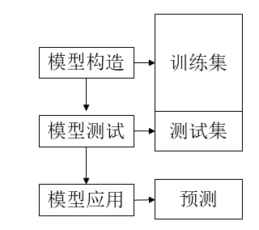
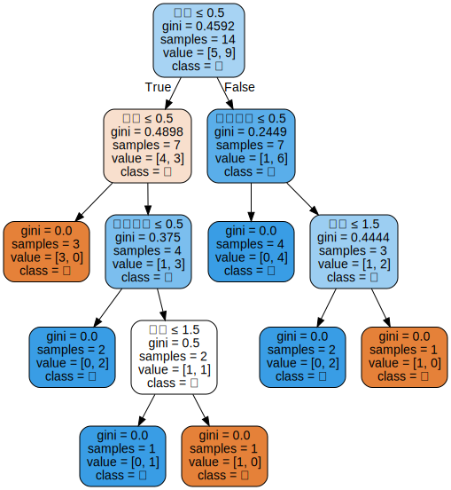

# 分类算法之决策树

## 分类的基本知识

### 分类的定义
分类又可称为监督学习（supervised learning, or learning by examples），它是在已知训练样本类别情况下，通过学习建立相应模型或规则, 并将得到的模型或规则用于预测数据对象的离散类别（categorical labels）.


### 分类的过程: 三个阶段
- 模型构造: 描述一组已知的类
    - 用来建模的样本(数据、对象、案例或记录)集合: training set
    - 条件属性（决策属性）和目标属性（类别）
    - 模型用分类规则、决策树或数学公式表示
- 模型测试：选择一组测试数据检测模型的准确度
    - 测试数据集(testing set)
    - 用模型推导出来的类标志与已知的类标志比较，如果相同，则称结果是正确的
    - 准确度等于测试数据集中由模型得到正确结果的比例
- 模型应用：
    - 利用得到的分类模型，预测在类别未知的情况下样本所属的类别



## 决策树
决策树(decision)是一种类似于流程图的树结构，其中每个内部结点表示在一个属性上的测试，每个分支代表该测试的一个输出，而每个树叶结点存放一个类标号。

### ID3算法
- 构造决策树，决策树的每个节点对应一个非类别属性，每条边对应该属性的每个可能值。
- 以信息熵的下降速度作为选取测试属性的标准，即所选的测试属性是从根到当前节点的路径上尚未被考虑的具有最高信息增益的属性。
- 终止规则：结点对应的所有样本属于同一类没有属性可以继续分割

#### 属性选择的计算方法：
原理：选择信息增益（比率）最大的属性

假设训练集 $T$ 包含 $n$ 个样本，这些样本分别属于 $m$ 个类，其中第 $i$ 个类在T中出现的比例为 $p_i$，$T$ 的信息量:
$$ I(T) = \sum_{i=1}^m -p_ilog_2p_i \tag{1} $$

假设属性 $A$ 把集合 $T$ 划分成 $V$ 个子集 $\left \{T_1, T_2 ,\dots, T_v \right \}$，其中 $T_i$ 所包含的样本数为 $n_i$，那么划分后的熵(entropy):
$$ E(A) = \sum_{i=1}^v\frac{n_i}{n}I(T_i) \tag{2} $$

信息增益（ID3）:
$$ Gain(A) = I(T) - E(A) \tag{3} $$

> 熵最初起于物理学：  分子杂乱的运动，后被Shannon引入信息论，信源整体的平均不定度


### 使用ID3算法划分决策树


```python
import matplotlib.pyplot as plt
import numpy as np
import pandas as pd

%matplotlib inline
```


```python
data = pd.read_excel('./data/决策树数据.xlsx')
data.head()
```


<div>
<table border="1" class="dataframe">
  <thead>
    <tr style="text-align: right;">
      <th></th>
      <th>age</th>
      <th>income</th>
      <th>student</th>
      <th>credit_rating</th>
      <th>label</th>
    </tr>
  </thead>
  <tbody>
    <tr>
      <th>0</th>
      <td>youth</td>
      <td>high</td>
      <td>no</td>
      <td>fair</td>
      <td>no</td>
    </tr>
    <tr>
      <th>1</th>
      <td>youth</td>
      <td>high</td>
      <td>no</td>
      <td>excellent</td>
      <td>no</td>
    </tr>
    <tr>
      <th>2</th>
      <td>middle_age</td>
      <td>high</td>
      <td>no</td>
      <td>fair</td>
      <td>yes</td>
    </tr>
    <tr>
      <th>3</th>
      <td>senior</td>
      <td>medium</td>
      <td>no</td>
      <td>fair</td>
      <td>yes</td>
    </tr>
    <tr>
      <th>4</th>
      <td>senior</td>
      <td>low</td>
      <td>yes</td>
      <td>fair</td>
      <td>yes</td>
    </tr>
  </tbody>
</table>
</div>


```python
x1 = np.array(data.drop(['label'], axis=1), dtype='<U11')
y1 = np.array(data['label'], dtype='<U11')
```


```python
## id3 需要安装 pip install decision-tree-id3
## 官方文档：https://github.com/svaante/decision-tree-id3
from id3 import Id3Estimator, export_graphviz
cls = Id3Estimator()
cls.fit(x1, y1)
export_graphviz(cls.tree_, './data/tree.dot', data.columns)
```


    <_io.TextIOWrapper name='./data/tree.dot' mode='w' encoding='utf8'>


运行完之后，会在data文件夹中生成一个tree.dot的文档,可以直接查看，也可以在data文件夹运行cmd，输入`dot -Tpdf tree.dot -o tree.pdf`，生成pdf的树的图形


```python
## 导入pdf查看
from IPython.display import IFrame
IFrame('./data/tree.pdf', width=450, height=500)
```


        <iframe
            width="450"
            height="500"
            src="./data/tree.pdf"
            frameborder="0"
            allowfullscreen
        ></iframe>


### 使用CART算法


```python
## 将类别数据转换为数值数据
data2 = data.copy()
for column in data.columns:
    data2[column] = pd.factorize(data[column])[0]
data2.head()
```


<div>
<table border="1" class="dataframe">
  <thead>
    <tr style="text-align: right;">
      <th></th>
      <th>age</th>
      <th>income</th>
      <th>student</th>
      <th>credit_rating</th>
      <th>label</th>
    </tr>
  </thead>
  <tbody>
    <tr>
      <th>0</th>
      <td>0</td>
      <td>0</td>
      <td>0</td>
      <td>0</td>
      <td>0</td>
    </tr>
    <tr>
      <th>1</th>
      <td>0</td>
      <td>0</td>
      <td>0</td>
      <td>1</td>
      <td>0</td>
    </tr>
    <tr>
      <th>2</th>
      <td>1</td>
      <td>0</td>
      <td>0</td>
      <td>0</td>
      <td>1</td>
    </tr>
    <tr>
      <th>3</th>
      <td>2</td>
      <td>1</td>
      <td>0</td>
      <td>0</td>
      <td>1</td>
    </tr>
    <tr>
      <th>4</th>
      <td>2</td>
      <td>2</td>
      <td>1</td>
      <td>0</td>
      <td>1</td>
    </tr>
  </tbody>
</table>
</div>


```python
x2 = np.array(data2.drop('label', axis=1))
y2 = np.array(data2['label'])
```


```python
## 训练数据
from sklearn.tree import DecisionTreeClassifier
from sklearn import tree
DT = DecisionTreeClassifier()
DT.fit(x2, y2)
```


    DecisionTreeClassifier(class_weight=None, criterion='gini', max_depth=None,
                max_features=None, max_leaf_nodes=None,
                min_impurity_split=1e-07, min_samples_leaf=1,
                min_samples_split=2, min_weight_fraction_leaf=0.0,
                presort=False, random_state=None, splitter='best')


```python
## 展示结果
import graphviz  
feature_names = [u'年龄',u'收入',u'学生',u'信用等级']
dot_data = tree.export_graphviz(DT, out_file=None,
                         feature_names=feature_names,  
                         class_names=['是','否'],  
                         filled=True, rounded=True,  
                         special_characters=True)
graph = graphviz.Source(dot_data)  
graph
```



