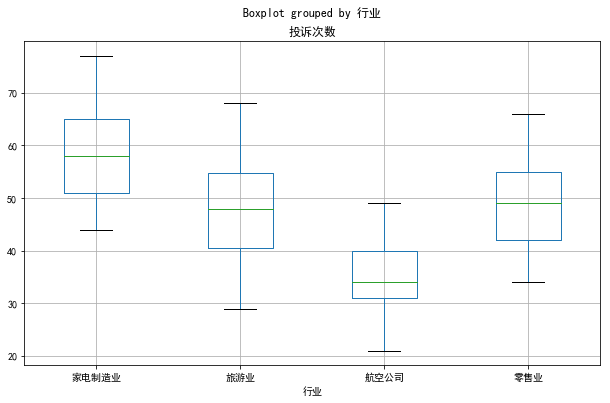
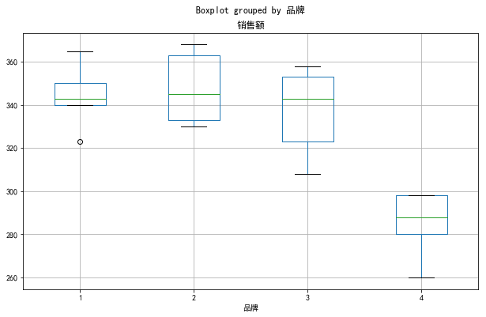
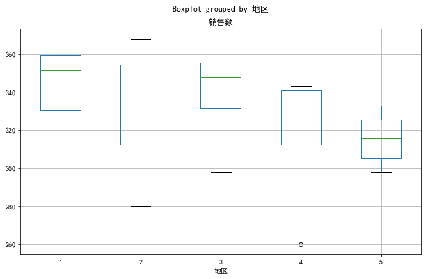

 # Table of Contents
<div class="toc" style="margin-top: 1em;"><ul class="toc-item" id="toc-level0"><li><span><a href="#方差分析概述" data-toc-modified-id="方差分析概述-1"><span class="toc-item-num">1&nbsp;&nbsp;</span>方差分析概述</a></span><ul class="toc-item"><li><span><a href="#单因素试验的方差分析" data-toc-modified-id="单因素试验的方差分析-1.1"><span class="toc-item-num">1.1&nbsp;&nbsp;</span>单因素试验的方差分析</a></span></li><li><span><a href="#单因素试验方差分析的数学模型" data-toc-modified-id="单因素试验方差分析的数学模型-1.2"><span class="toc-item-num">1.2&nbsp;&nbsp;</span>单因素试验方差分析的数学模型</a></span></li><li><span><a href="#双因素无重复试验的方差分析" data-toc-modified-id="双因素无重复试验的方差分析-1.3"><span class="toc-item-num">1.3&nbsp;&nbsp;</span>双因素无重复试验的方差分析</a></span></li></ul></li><li><span><a href="#python实现方差分析" data-toc-modified-id="python实现方差分析-2"><span class="toc-item-num">2&nbsp;&nbsp;</span>python实现方差分析</a></span><ul class="toc-item"><li><span><a href="#单因素" data-toc-modified-id="单因素-2.1"><span class="toc-item-num">2.1&nbsp;&nbsp;</span>单因素</a></span></li><li><span><a href="#双因素" data-toc-modified-id="双因素-2.2"><span class="toc-item-num">2.2&nbsp;&nbsp;</span>双因素</a></span></li></ul></li></ul></div>

# 方差分析概述

## 单因素试验的方差分析

**方差分析**是根据试验的结果进行分析,鉴别各个有关因素对试验结果的影响程度.
>方差分析（ANOVA）是一种特殊形式的统计假设检定，广泛应用于实验数据的分析中。统计假设检定是一种根据数据进行决策的方法。测试结果（通过零假设进行计算）如果不仅仅是因为运气，则在统计学上称为显著。统计显著的结果（当可能性的p值小于临界的“显著值”）则可以推翻零假设。

## 单因素试验方差分析的数学模型


**假设**：
 1. 各组样本背后所隐含的族群分布必须为正态分布或者是逼近正态分布。
 2. 各组样本必须独立。
 3. 族群的方差必须相等。


 **平方和的分解：**
- 总平方和：
 $$ S_T = \sum_{j=1}^{s}\sum_{i=1}^{n_j}(X_{ij}-\bar{X})^2  \tag{1}$$
- 误差平方和：
  $$ S_E = \sum_{j=1}^{s}\sum_{i=1}^{n_j}(X_{ij}-\bar{X}_{\cdot j})^2  \tag{2}$$
- 效应平方和：
  $$ S_A = \sum_{j=1}^{s}\sum_{i=1}^{n_j}(\bar{X}_{\cdot j}-\bar{X})^2  \tag{3}$$

- 平方和公式：
$$ S_T = S_E + S_A \tag{4} $$


** 单因素试验方差分析表 **

| 方差来源 	| 平方和 	| 自由度 	|             均方            	|             F统计量             	|   P值   	|
|:--------:	|:------:	|:------:	|:---------------------------:	|:-------------------------------:	|:-------:	|
|   因素A  	|  $S_A$ 	|  $s-1$ 	| $\bar{S_A}=\frac{S_A}{s-1}$ 	| $F=\frac{\bar{S}_A}{\bar{S}_E}$ 	| $p$ value 	|
|   误差   	|  $S_E$ 	|  $n-s$ 	| $\bar{S_E}=\frac{S_E}{n-s}$ 	|                                 	|         	|
|   总和   	|  $S_T$ 	|  $n-1$ 	|                             	|                                 	|         	|

## 双因素无重复试验的方差分析
- 检验两个因素的交互效应,对两个因素的每一组合至少要做两次试验.
- 如果已知不存在交互作用,或已知交互作用对试验的指标影响很小,则可以不考虑交互作用.
- 对两个因素的每一组合只做一次试验,也可以对各因素的效应进行分析——双因素无重复试验的方差分析.


# python实现方差分析

## 单因素


```python
import pandas as pd
data1 = pd.read_excel('./data/方差分析.xlsx', sheetname='消费')
data1.head()
```


<div>
<style>
    .dataframe thead tr:only-child th {
        text-align: right;
    }

    .dataframe thead th {
        text-align: left;
    }

    .dataframe tbody tr th {
        vertical-align: top;
    }
</style>
<table border="1" class="dataframe">
  <thead>
    <tr style="text-align: right;">
      <th></th>
      <th>行业</th>
      <th>投诉次数</th>
    </tr>
  </thead>
  <tbody>
    <tr>
      <th>0</th>
      <td>零售业</td>
      <td>57</td>
    </tr>
    <tr>
      <th>1</th>
      <td>零售业</td>
      <td>66</td>
    </tr>
    <tr>
      <th>2</th>
      <td>零售业</td>
      <td>49</td>
    </tr>
    <tr>
      <th>3</th>
      <td>零售业</td>
      <td>40</td>
    </tr>
    <tr>
      <th>4</th>
      <td>零售业</td>
      <td>34</td>
    </tr>
  </tbody>
</table>
</div>


```python
data1.boxplot(column='投诉次数',by='行业', figsize=(10,6));
```





```python
import statsmodels.api as sm
import statsmodels.formula.api as smf
ols = smf.ols('投诉次数 ~ C(行业) ',data=data1).fit()
f1= sm.stats.anova_lm(ols)
f1
```

    C:\Users\J\AppData\Local\Continuum\Anaconda3\lib\site-packages\statsmodels\compat\pandas.py:56: FutureWarning: The pandas.core.datetools module is deprecated and will be removed in a future version. Please use the pandas.tseries module instead.
      from pandas.core import datetools
    C:\Users\J\AppData\Local\Continuum\Anaconda3\lib\site-packages\scipy\stats\_distn_infrastructure.py:879: RuntimeWarning: invalid value encountered in greater
      return (self.a < x) & (x < self.b)
    C:\Users\J\AppData\Local\Continuum\Anaconda3\lib\site-packages\scipy\stats\_distn_infrastructure.py:879: RuntimeWarning: invalid value encountered in less
      return (self.a < x) & (x < self.b)
    C:\Users\J\AppData\Local\Continuum\Anaconda3\lib\site-packages\scipy\stats\_distn_infrastructure.py:1818: RuntimeWarning: invalid value encountered in less_equal
      cond2 = cond0 & (x <= self.a)


<div>
<style>
    .dataframe thead tr:only-child th {
        text-align: right;
    }

    .dataframe thead th {
        text-align: left;
    }

    .dataframe tbody tr th {
        vertical-align: top;
    }
</style>
<table border="1" class="dataframe">
  <thead>
    <tr style="text-align: right;">
      <th></th>
      <th>df</th>
      <th>sum_sq</th>
      <th>mean_sq</th>
      <th>F</th>
      <th>PR(&gt;F)</th>
    </tr>
  </thead>
  <tbody>
    <tr>
      <th>C(行业)</th>
      <td>3.0</td>
      <td>1456.608696</td>
      <td>485.536232</td>
      <td>3.406643</td>
      <td>0.038765</td>
    </tr>
    <tr>
      <th>Residual</th>
      <td>19.0</td>
      <td>2708.000000</td>
      <td>142.526316</td>
      <td>NaN</td>
      <td>NaN</td>
    </tr>
  </tbody>
</table>
</div>


## 双因素


```python
data2 = pd.read_excel('./data/方差分析.xlsx',sheetname='电视')
data2.head()
```


<div>
<style>
    .dataframe thead tr:only-child th {
        text-align: right;
    }

    .dataframe thead th {
        text-align: left;
    }

    .dataframe tbody tr th {
        vertical-align: top;
    }
</style>
<table border="1" class="dataframe">
  <thead>
    <tr style="text-align: right;">
      <th></th>
      <th>品牌</th>
      <th>地区</th>
      <th>销售额</th>
    </tr>
  </thead>
  <tbody>
    <tr>
      <th>0</th>
      <td>1</td>
      <td>1</td>
      <td>365</td>
    </tr>
    <tr>
      <th>1</th>
      <td>2</td>
      <td>1</td>
      <td>345</td>
    </tr>
    <tr>
      <th>2</th>
      <td>3</td>
      <td>1</td>
      <td>358</td>
    </tr>
    <tr>
      <th>3</th>
      <td>4</td>
      <td>1</td>
      <td>288</td>
    </tr>
    <tr>
      <th>4</th>
      <td>1</td>
      <td>2</td>
      <td>350</td>
    </tr>
  </tbody>
</table>
</div>


```python
data2.boxplot(column='销售额',by='品牌',figsize=(10,6))
data2.boxplot(column='销售额',by='地区',figsize=(10,6));
```








```python
ols2 = smf.ols('销售额 ~ C(地区) + C(品牌)',data=data2).fit()
f2 = sm.stats.anova_lm(ols2)
f2
```

    C:\Users\J\AppData\Local\Continuum\Anaconda3\lib\site-packages\scipy\stats\_distn_infrastructure.py:879: RuntimeWarning: invalid value encountered in greater
      return (self.a < x) & (x < self.b)
    C:\Users\J\AppData\Local\Continuum\Anaconda3\lib\site-packages\scipy\stats\_distn_infrastructure.py:879: RuntimeWarning: invalid value encountered in less
      return (self.a < x) & (x < self.b)
    C:\Users\J\AppData\Local\Continuum\Anaconda3\lib\site-packages\scipy\stats\_distn_infrastructure.py:1818: RuntimeWarning: invalid value encountered in less_equal
      cond2 = cond0 & (x <= self.a)


<div>
<style>
    .dataframe thead tr:only-child th {
        text-align: right;
    }

    .dataframe thead th {
        text-align: left;
    }

    .dataframe tbody tr th {
        vertical-align: top;
    }
</style>
<table border="1" class="dataframe">
  <thead>
    <tr style="text-align: right;">
      <th></th>
      <th>df</th>
      <th>sum_sq</th>
      <th>mean_sq</th>
      <th>F</th>
      <th>PR(&gt;F)</th>
    </tr>
  </thead>
  <tbody>
    <tr>
      <th>C(地区)</th>
      <td>4.0</td>
      <td>2011.70</td>
      <td>502.925000</td>
      <td>2.100846</td>
      <td>0.143665</td>
    </tr>
    <tr>
      <th>C(品牌)</th>
      <td>3.0</td>
      <td>13004.55</td>
      <td>4334.850000</td>
      <td>18.107773</td>
      <td>0.000095</td>
    </tr>
    <tr>
      <th>Residual</th>
      <td>12.0</td>
      <td>2872.70</td>
      <td>239.391667</td>
      <td>NaN</td>
      <td>NaN</td>
    </tr>
  </tbody>
</table>
</div>
