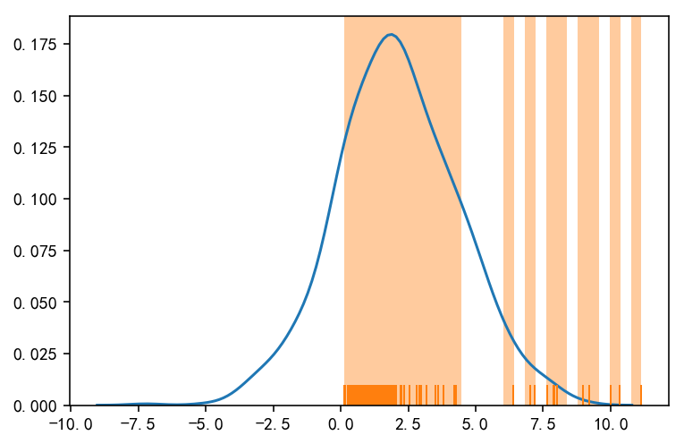
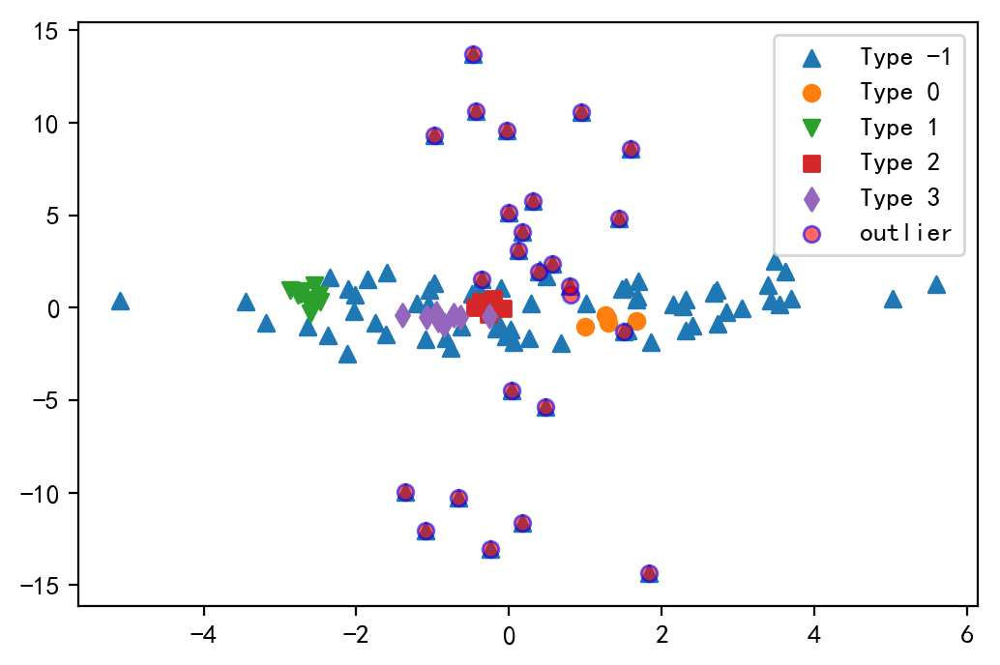

 # Table of Contents
<div class="toc" style="margin-top: 1em;"><ul class="toc-item" id="toc-level0"><li><span><a href="#异常检测介绍及分类" data-toc-modified-id="异常检测介绍及分类-1"><span class="toc-item-num">1&nbsp;&nbsp;</span>异常检测介绍及分类</a></span></li><li><span><a href="#异常检测方法" data-toc-modified-id="异常检测方法-2"><span class="toc-item-num">2&nbsp;&nbsp;</span>异常检测方法</a></span><ul class="toc-item"><li><span><a href="#统计学方法" data-toc-modified-id="统计学方法-2.1"><span class="toc-item-num">2.1&nbsp;&nbsp;</span>统计学方法</a></span><ul class="toc-item"><li><span><a href="#参数方法" data-toc-modified-id="参数方法-2.1.1"><span class="toc-item-num">2.1.1&nbsp;&nbsp;</span>参数方法</a></span><ul class="toc-item"><li><span><a href="#基于正态分布的一元离群点检测" data-toc-modified-id="基于正态分布的一元离群点检测-2.1.1.1"><span class="toc-item-num">2.1.1.1&nbsp;&nbsp;</span>基于正态分布的一元离群点检测</a></span></li><li><span><a href="#多元离群点检测" data-toc-modified-id="多元离群点检测-2.1.1.2"><span class="toc-item-num">2.1.1.2&nbsp;&nbsp;</span>多元离群点检测</a></span></li><li><span><a href="#使用混合参数分布检验多元离群点" data-toc-modified-id="使用混合参数分布检验多元离群点-2.1.1.3"><span class="toc-item-num">2.1.1.3&nbsp;&nbsp;</span>使用混合参数分布检验多元离群点</a></span></li></ul></li><li><span><a href="#非参数方法" data-toc-modified-id="非参数方法-2.1.2"><span class="toc-item-num">2.1.2&nbsp;&nbsp;</span>非参数方法</a></span><ul class="toc-item"><li><span><a href="#使用直方图检验离群点" data-toc-modified-id="使用直方图检验离群点-2.1.2.1"><span class="toc-item-num">2.1.2.1&nbsp;&nbsp;</span>使用直方图检验离群点</a></span></li><li><span><a href="#核密度估计KDE（Kernel-Density-Estimation）" data-toc-modified-id="核密度估计KDE（Kernel-Density-Estimation）-2.1.2.2"><span class="toc-item-num">2.1.2.2&nbsp;&nbsp;</span>核密度估计KDE（Kernel Density Estimation）</a></span></li></ul></li></ul></li><li><span><a href="#基于近邻的方法" data-toc-modified-id="基于近邻的方法-2.2"><span class="toc-item-num">2.2&nbsp;&nbsp;</span>基于近邻的方法</a></span><ul class="toc-item"><li><span><a href="#LOF算法" data-toc-modified-id="LOF算法-2.2.1"><span class="toc-item-num">2.2.1&nbsp;&nbsp;</span>LOF算法</a></span></li></ul></li><li><span><a href="#基于聚类的方法" data-toc-modified-id="基于聚类的方法-2.3"><span class="toc-item-num">2.3&nbsp;&nbsp;</span>基于聚类的方法</a></span><ul class="toc-item"><li><span><a href="#KMeans" data-toc-modified-id="KMeans-2.3.1"><span class="toc-item-num">2.3.1&nbsp;&nbsp;</span>KMeans</a></span></li><li><span><a href="#DBSCAN" data-toc-modified-id="DBSCAN-2.3.2"><span class="toc-item-num">2.3.2&nbsp;&nbsp;</span>DBSCAN</a></span></li></ul></li><li><span><a href="#基于分类的方法" data-toc-modified-id="基于分类的方法-2.4"><span class="toc-item-num">2.4&nbsp;&nbsp;</span>基于分类的方法</a></span><ul class="toc-item"><li><span><a href="#One-class-SVM" data-toc-modified-id="One-class-SVM-2.4.1"><span class="toc-item-num">2.4.1&nbsp;&nbsp;</span>One-class SVM</a></span></li></ul></li></ul></li></ul></div>

# 异常检测介绍及分类

**异常检测**：
- 异常检测（也称为离群点检测）是找出其行为很不同于预期对象的过程，该对象称为离群点。
- 离群点 (outlier)是指一个与其他数据对象显著不同的数据对象，好像它是由不同机制产生的一样。

**离群点分类**：
1. 全局离群点（global outlier）是指该对象显著地偏离数据集中的其余对象，有时也称为点异常。
2. 情境离群点(contextual outlier)是指该对象在特定情境下，显著地偏离其他对象，有时也称为条件离群点。
3. 集体离群点（collective outlier）是指该对象集作为整体显著地偏离整个数据集。

**离群点检测方法**：
- 监督、半监督、无监督方法：
    1. 监督方法：通过对已经标记好的正常数据和异常数据进行建模，运用分类的方法识别出异常数据。
    2. 无监督方法：对于没有被标记的数据进行建模，如运用聚类的方法找出异常的簇。
    3. 半监督方法：对于部分被标记数据进行建模，可以综合使用监督和无监督方法对数据进行建模。
- 统计方法、基于邻近性方法和基于聚类方法：
    1. 统计学方法（又称为基于模型的方法）对数据的正常性进行假设，假设正常的数据对象由一个统计模型产生，而遵守该模型的数据可以视为异常点。
    2. 基于临近性的方法是如果该对象在特征空间上显著偏离其临近点，则假定对象是离群点。
    3. 基于聚类的方法是假定正常数据对象属于大的、稠密的簇，而离群点属于小的或稀疏的簇，或者不属于任何簇。

# 异常检测方法

## 统计学方法

异常检测的统计学方法是对数据的正常性进行假设，假定他们由一个随机过程产生。则正常的数据对应于高的概率密度，低密度数据可以视为异常数据

### 参数方法
参数方法是假设正常数据被一个以 $\Theta$ 为参数的参数分布产生，该参数分布的概率密度函数 $f(x, \Theta)$ 给出对象 $x$ 被该分布产生的概率，该值越小越可能是离群点。

#### 基于正态分布的一元离群点检测
- 仅涉及一个属性或变量的数据称为一元数据，我们假定该数据服从正态分布，通过数据学习正态分布的参数，把低概率的点识别为异常点。

- 另一种使用正态分布的一元离群点检测的统计学方法是 Grubb 检验（也称为最大标准残差检验）。如果数据 $x$ 满足下式，则该数据为离群点。
$$ z = \frac{\left |x-\bar{x} \right | }{s} \tag{1}$$
$$ z \geqslant \frac{N-1}{\sqrt{n}}\sqrt{\frac{t^{2}_{\alpha/(2N), N-2}}{N-2+t^{2}_{\alpha/(2N), N-2}}} \tag{2} $$


```python
## 数据
import numpy
data1 = np.array([24.0, 28.9, 28.9, 29.0, 29.1, 29.1, 29.2, 29.2, 29.3, 29.4])
```


```python
## 估计 均值 和 标准差
from scipy import stats
mu, sigma = stats.norm.fit(data1)
print('均值为：%.2f \n标准差为：%.2f' %(mu, sigma))
```

    均值为：28.61
    标准差为：1.54


```python
## 绘制正态分布图和该数据的hist图
import seaborn as sns
import matplotlib.pyplot as plt

x = np.linspace(23,35,1000)
y = stats.norm.pdf(x, loc=mu, scale=sigma)    # for example
plt.plot(x,y)
#plt.hist(data1, normed=True);
sns.distplot(data1, rug=True, kde=False, norm_hist=True);
```


```python
## 计算在估计出来的均值和标准差的正态分布下的每个数据对应的概率值
stats.norm.pdf(data1, mu, sigma)
```


    array([ 0.00300022,  0.25381518,  0.25381518,  0.25022237,  0.24564824,
            0.24564824,  0.24014866,  0.24014866,  0.23378985,  0.22664708])


- 从图中可以明显看出第一个数据（24.0）在正态分布下的出现概率非常低，因此可以视为是异常点。
- 从估计的概率也可以明显看出第一个数据的估计概率为0.003非常小。

#### 多元离群点检测
涉及两个或多个属性或变量的数据称为多元数据。
对于多元离群点检测的方法有：
1. 把多元离群点检测任务转换为一元离群点检测问题，如：
    - 使用马哈拉诺比斯（mahalanobis）距离检测多元离群点，通过将数据 $o$ 进行变换，变换后的数据即可使用 Grubb 检验
    $$ MDist(o,\bar{o}) = (o-\bar{o})^TS^{-1}(o-\bar{o}) \tag{3} $$
    - 使用 $\chi^2$ 统计量来检测多元离群点,计算数据对象 $o$ 点对应的 $\chi^2$ 统计量，如果$\chi^2$ 很大，则该对象时离群点
    $$ \chi^2 = \sum_{i=1}^{n} \frac{(o_i -\mu_i)^2}{\mu_i} \tag{4} $$


```python
## 生成数据
n_samples = 125
n_outliers = 25
n_features = 2
# generate data
gen_cov = np.eye(n_features)
gen_cov[0, 0] = 2.
X = np.dot(np.random.randn(n_samples, n_features), gen_cov)
# add some outliers
outliers_cov = np.eye(n_features)
outliers_cov[np.arange(1, n_features), np.arange(1, n_features)] = 7.
X[-n_outliers:] = np.dot(np.random.randn(n_outliers, n_features), outliers_cov)
```


```python
from sklearn.covariance import MinCovDet
## MinCovDet 是一种估计方差的稳健（robust）的方法
robust_cov = MinCovDet().fit(X)

## 给出前5个数据数据的 mahalanobis 距离
a = np.sqrt(robust_cov.mahalanobis(X))
a[:5]
```


    array([ 1.05818205,  0.99783782,  2.91092   ,  2.22260092,  1.65766118])


```python
## 绘出数据的hist图和估计出来的正态分布图

sns.kdeplot(np.random.normal(*stats.norm.fit(a), size=1000))
sns.distplot(a, rug=True, kde=False);
## 估计前5个数据的概率
stats.norm.pdf(a, *stats.norm.fit(a))[:5]
```


    array([ 0.15910475,  0.15720954,  0.16331906,  0.17473624,  0.17251196])





```python
## 绘制给定数据的 mahalanobis 距离
# Display results
fig = plt.figure(figsize=(8,3),dpi=100)
markers = ['^', 'o', 'v', 's', 'd']
# Show data set
plt.scatter(X[:, 0], X[:, 1], label='inliers', marker=markers[0])
plt.scatter(X[:, 0][-n_outliers:], X[:, 1][-n_outliers:],color='red', marker=markers[1], label='outliers')
# Show contours of the distance functions
xx, yy = np.meshgrid(np.linspace(plt.xlim()[0], plt.xlim()[1], 100),
                     np.linspace(plt.ylim()[0], plt.ylim()[1], 100))
zz = np.c_[xx.ravel(), yy.ravel()]
mahal_robust_cov = robust_cov.mahalanobis(zz)
mahal_robust_cov = mahal_robust_cov.reshape(xx.shape)
plt.contour(xx, yy, np.sqrt(mahal_robust_cov),cmap=plt.cm.YlOrBr_r,)
plt.legend();
```


#### 使用混合参数分布检验多元离群点
假定数据是由正态分布产生在很多情况下是有效的，但是，当实际情况比较复杂的时候，这样的假设过于简单。所以我们可以假定数据是由多个分布混合而成。


```python
from sklearn.mixture import GaussianMixture
gmm = GaussianMixture(n_components=2,)
gmm.fit(X)
y_p = gmm.predict(X)
```


```python
plt.figure(dpi=100)
plt.scatter(X[y_p==0, 0], X[y_p==0, 1], 20, c='b', marker=markers[0], label='predict_inlier')
plt.scatter(X[y_p==1, 0], X[y_p==1, 1], 20, c='g', marker=markers[1],label='predict_outlier')
plt.scatter(X[-n_outliers:, 0], X[-n_outliers:, 1], c='r', marker=markers[2],edgecolor='k',s=20,alpha=0.5, label='outlier',)
xx, yy = np.meshgrid(np.linspace(-7., 7.), np.linspace(-25., 22.))
Z = -(gmm.score_samples(np.array([xx.ravel(), yy.ravel()]).T))
Z = Z.reshape(xx.shape)
plt.contour(xx, yy, Z, )
plt.legend();
```


### 非参数方法
非参数的方法对数据做较小的假定，因而在更多情况下都可以使用

#### 使用直方图检验离群点
- 构造直方图
- 检测离群点：可以看该数据是否落入箱中判断该点是否为离群点。也可以给每个点赋予离群点得分，离群点的得分可以是该对象落入箱的容积的倒数


```python
plt.hist(data1);
## 可以看出第一个对象可能是离群点
```


#### 核密度估计KDE（Kernel Density Estimation）
直方图作为离群点检测的非参数方法一个缺点是，很难选择一个合适的箱尺寸。为了解决这个问题，可以采用核密度估计来估计概率密度分布

一个常用核函数是高斯核：
$$ K(\frac{x-x_i)}{h}) = \frac{1}{\sqrt{2 \pi }}e^{-\frac{(x-x_i)^2}{2h^2}} \tag{5} $$
设 $x_1,\dots,x_n $ 是随机变量 $f$ 的独立同分布样本，该概率密度函数的和函数近似为：
$$ \hat{f}_h(x) = \frac{1}{n}\sum_{i=1}^{n} K\left (\frac{x-x_i}{h} \right) \tag{6} $$
其中， $k()$ 是核函数； $h$ 是带宽，充当光滑参数。


```python
## 核函数估计曲线
sns.distplot(data1);
```


```python
## 给出每个数据的对数概率
from sklearn.neighbors.kde import KernelDensity
kde = KernelDensity(kernel='gaussian', bandwidth=0.2).fit(data1.reshape((-1,1)))
score = kde.score_samples(data1.reshape((-1,1)))
plt.bar(range(len(score)), score);
```


## 基于近邻的方法

基于近邻的方法有：
- 基于距离的离群点检测方法
- 基于网格的离群点方法
- 基于密度的离群点检测方法

### LOF算法
LOF（Local Outlier Factor）是基于密度的离群点检测方法。

其基本思想是通过比较这个对象相对于其邻居对象平均密度的大小来判断该点是否为离群点。

- 首先，要如何定义一个对象的邻居呢？我们可以以该数据为中心画一个圈，找个圈的最大距离为这个点到其到最近的第 $k$ 个点的距离。在圈内其他数据可以视为其邻居。所以我们以此定义 $dist_k(o)$ 和 $N_k(o)$ 分别表示这个圈的半径和圈内的邻居。其中 $dist_k(o)$ 为 $o$ 到最近的第 $k$ 个点的距离， $N_k(o)$ 为所有与 $o$ 距离小于 $dist_k(o)$ 的数据。
- 然后，要如何表示密度呢？简单的想法是以 $N_k(o)$ 中对象到 $o$ 的平均距离的倒数作为 $o$ 点的局部密度，但是这样简单的度量有一个问题：如果有一个非常近的邻居 $o^{'}$ 使得 $dist(o, o^{'})$ 非常小，则距离度量的波动性可能会出乎意料的高。为了解决这个问题，可以用过加上光滑效果，定义可达距离 $reachdist_k(o \leftarrow o^{'})$ 来处理。：
$$ reachdist_k(o \leftarrow o^{'}) = max \left \{ dist(o, o^{'}), dist_k(o) \right\} \tag{7} $$
    则密度可以表示为该点邻居的到该点的平均可达距离的倒数：
    $$ lrd_k(o) = \frac{ \left \| N_k(o) \right \| }{\sum_{o^{'} \in N_k(o)} reachdist_k(o \leftarrow o^{'}) } \tag{8} $$

- 最后通过比较该对象相对于其邻居的平均密度即可判断出该点是否为离群点，该点相对于邻居平均密度越大，说明该点周围相对越紧密，反之越离散。所以定义其倒数为局部异常因子 $LOF$ ：
$$ LOF_k{o} = \frac{\sum_{o^{'} \in N_k(o)}  \frac{lrd_k(o{'})}{lrd_k(o)} }{ \left \| N_k(o) \right \| } \tag{9} $$


```python
from sklearn.neighbors import LocalOutlierFactor
clf = LocalOutlierFactor(n_neighbors=20)
y_pred = clf.fit_predict(X)
```


```python
plt.figure(dpi=100)
xx, yy = np.meshgrid(np.linspace(-6,6, 50), np.linspace(-22,20, 50))
Z = clf._decision_function(np.c_[xx.ravel(), yy.ravel()])
Z = Z.reshape(xx.shape)
plt.contour(xx, yy, Z, cmap=plt.cm.GnBu);
plt.scatter(X[y_pred==1, 0], X[y_pred==1, 1], c='b',s=20,edgecolor='k', marker=markers[0], label='predict_inlier')
plt.scatter(X[y_pred==-1, 0], X[y_pred==-1, 1], c='g',s=20,edgecolor='k',  marker=markers[1],label='predict_outlier')
plt.scatter(X[-n_outliers:, 0], X[-n_outliers:, 1], c='r', edgecolor='k',marker=markers[2],s=20,alpha=0.5, label='outlier',)
plt.legend();
```


## 基于聚类的方法

离群点的概念与簇的概念高度相关，基于聚类的方法通过考察对象与簇之间的关系检测离群点。
离群点检测的三种方法：
- 该对象不属于任何一个簇
- 该对象与最近的簇之间的距离非常远
- 该对象时小簇或者稀疏簇的一部分，整个簇都可能是异常

### KMeans


```python
from sklearn.cluster import KMeans

kmeans = KMeans(n_clusters=2)
kmeans.fit(X)
```


    KMeans(algorithm='auto', copy_x=True, init='k-means++', max_iter=300,
        n_clusters=2, n_init=10, n_jobs=1, precompute_distances='auto',
        random_state=None, tol=0.0001, verbose=0)


```python
plt.figure(dpi=100)
plt.scatter(X[kmeans.labels_==0,0],X[kmeans.labels_==0,1], marker=markers[0],label='predict_outlier')
plt.scatter(X[kmeans.labels_==1,0],X[kmeans.labels_==1,1], marker=markers[1],label='predict_inlier')
plt.scatter(X[- n_outliers:,0],X[- n_outliers:,1], edgecolor='b', marker=markers[2],label='outlier', alpha=0.5)
plt.legend();
```


### DBSCAN


```python
from sklearn.cluster import DBSCAN
dbscan = DBSCAN(eps=0.4)
dbscan.fit(X)
```


    DBSCAN(algorithm='auto', eps=0.4, leaf_size=30, metric='euclidean',
        metric_params=None, min_samples=5, n_jobs=1, p=None)


```python
plt.figure(dpi=100)
for i, marker in zip(np.unique(dbscan.labels_), markers):
    plt.scatter(X[dbscan.labels_==i,0],X[dbscan.labels_==i,1], marker=marker, label='Type '+str(i))
plt.scatter(X[- n_outliers:,0],X[- n_outliers:,1], c='r', edgecolor='b', label='outlier', alpha=0.6)
plt.legend();
```





## 基于分类的方法

可以使用 one class 来学习正常类的边界。给定一个新对象，如果该对象在正常边界内，则视为正常，反之视为异常。

### One-class SVM


```python
from sklearn.svm import OneClassSVM
ocs = OneClassSVM(nu=0.1, kernel="rbf", gamma=0.1)
ocs.fit(X)
```


    OneClassSVM(cache_size=200, coef0=0.0, degree=3, gamma=0.1, kernel='rbf',
          max_iter=-1, nu=0.1, random_state=None, shrinking=True, tol=0.001,
          verbose=False)


```python
plt.figure(dpi=100)
xx, yy = np.meshgrid(np.linspace(-6,6, 50), np.linspace(-22,20, 50))
Z = ocs._decision_function(np.c_[xx.ravel(), yy.ravel()])
Z = Z.reshape(xx.shape)
plt.contour(xx, yy, Z, cmap=plt.cm.GnBu);
plt.scatter(X[ocs.predict(X)==1, 0], X[ocs.predict(X)==1, 1],marker=markers[0], c='b',s=20,edgecolor='k',  label='predict_inlier')
plt.scatter(X[ocs.predict(X)==-1, 0], X[ocs.predict(X)==-1, 1], marker=markers[1],c='g',s=20,edgecolor='k',  label='predict_outlier')
plt.scatter(X[-n_outliers:, 0], X[-n_outliers:, 1], c='r',marker=markers[2], edgecolor='k',s=20,alpha=0.5, label='outlier',)
plt.legend();
```


