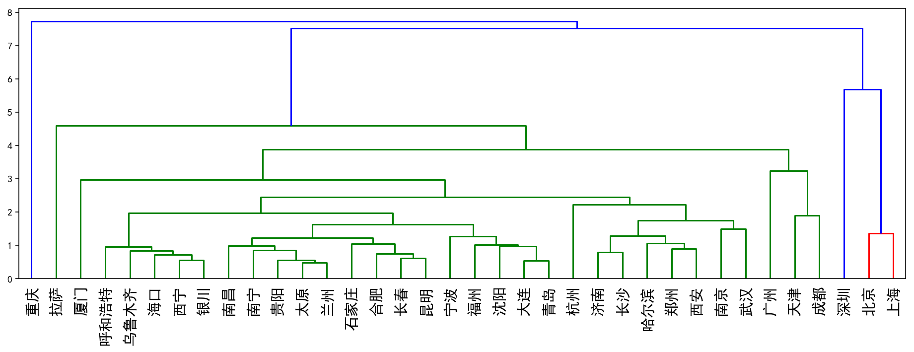
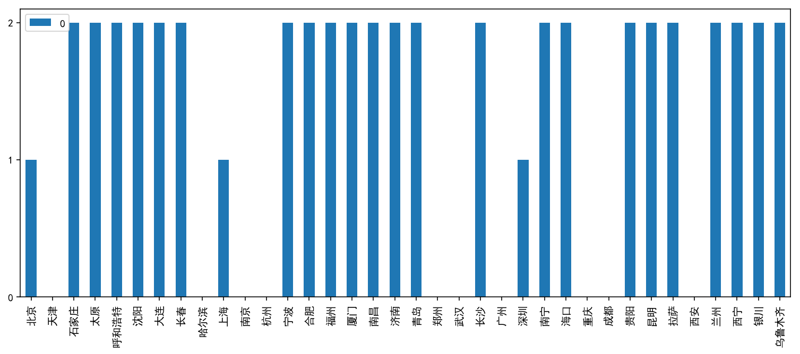
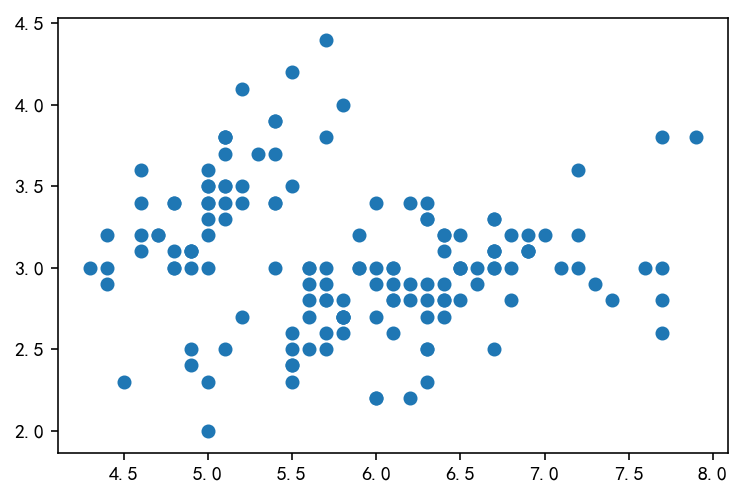
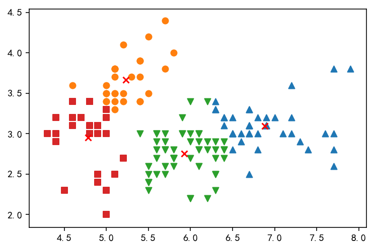

 # Table of Contents
<div class="toc" style="margin-top: 1em;"><ul class="toc-item" id="toc-level0"><li><span><a href="#聚类分析概述" data-toc-modified-id="聚类分析概述-1"><span class="toc-item-num">1&nbsp;&nbsp;</span>聚类分析概述</a></span><ul class="toc-item"><li><span><a href="#-聚类分析的分类：-" data-toc-modified-id="-聚类分析的分类：--1.1"><span class="toc-item-num">1.1&nbsp;&nbsp;</span><strong> 聚类分析的分类： </strong></a></span></li><li><span><a href="#距离的度量：" data-toc-modified-id="距离的度量：-1.2"><span class="toc-item-num">1.2&nbsp;&nbsp;</span>距离的度量：</a></span><ul class="toc-item"><li><span><a href="#距离的定义方式：" data-toc-modified-id="距离的定义方式：-1.2.1"><span class="toc-item-num">1.2.1&nbsp;&nbsp;</span>距离的定义方式：</a></span></li><li><span><a href="#相似系数" data-toc-modified-id="相似系数-1.2.2"><span class="toc-item-num">1.2.2&nbsp;&nbsp;</span>相似系数</a></span></li></ul></li></ul></li><li><span><a href="#系统聚类的基本思想" data-toc-modified-id="系统聚类的基本思想-2"><span class="toc-item-num">2&nbsp;&nbsp;</span>系统聚类的基本思想</a></span><ul class="toc-item"><li><span><a href="#系统聚类的基本步骤" data-toc-modified-id="系统聚类的基本步骤-2.1"><span class="toc-item-num">2.1&nbsp;&nbsp;</span>系统聚类的基本步骤</a></span></li><li><span><a href="#系统聚类(Hierarchical-clustering)" data-toc-modified-id="系统聚类(Hierarchical-clustering)-2.2"><span class="toc-item-num">2.2&nbsp;&nbsp;</span>系统聚类(Hierarchical clustering)</a></span></li><li><span><a href="#类间距离" data-toc-modified-id="类间距离-2.3"><span class="toc-item-num">2.3&nbsp;&nbsp;</span>类间距离</a></span></li><li><span><a href="#实验" data-toc-modified-id="实验-2.4"><span class="toc-item-num">2.4&nbsp;&nbsp;</span>实验</a></span></li></ul></li><li><span><a href="#快速聚类" data-toc-modified-id="快速聚类-3"><span class="toc-item-num">3&nbsp;&nbsp;</span>快速聚类</a></span><ul class="toc-item"><li><span><a href="#聚类分析要注意的问题" data-toc-modified-id="聚类分析要注意的问题-3.1"><span class="toc-item-num">3.1&nbsp;&nbsp;</span>聚类分析要注意的问题</a></span></li><li><span><a href="#在图像分割上的简单应用" data-toc-modified-id="在图像分割上的简单应用-3.2"><span class="toc-item-num">3.2&nbsp;&nbsp;</span>在图像分割上的简单应用</a></span></li><li><span><a href="#实验" data-toc-modified-id="实验-3.3"><span class="toc-item-num">3.3&nbsp;&nbsp;</span>实验</a></span><ul class="toc-item"><li><span><a href="#可视化" data-toc-modified-id="可视化-3.3.1"><span class="toc-item-num">3.3.1&nbsp;&nbsp;</span>可视化</a></span></li></ul></li></ul></li></ul></div>

# 聚类分析概述

- 聚类分析又称群分析，它是研究（样品或指标）分类问题的一种多元统计方法，所谓类，通俗地说，就是指相似元素的集合。 
- 聚类分析内容非常丰富，有系统聚类法、有序样品聚类法、动态聚类法、模糊聚类法、图论聚类法、聚类预报法等。

## ** 聚类分析的分类： **
- **样品聚类** （ Q 型聚类）：对事件(Cases)进行聚类，或是说对观测量进行聚类。
- **变量聚类** （ R 型聚类）：进行变量聚类，找出彼此独立且有代表性的自变量，而又不丢失大部分信息 

## 距离的度量：
- 为了将样品（或指标）进行分类，就需要研究样品之间关系。
- 目前用得最多的方法有两个：
    - 一种方法：相似系数；
    - 另一种方法：距离 ；

### 距离的定义方式：
- 绝对值距离：
    $$ d_{ij}=\sum_{k=1}^{p}\left |{x_{ik}-x_{jk}}\right| \tag{1} $$
- 欧氏(Euclidean)距离：
    $$ d_{ij}= \left[\sum_{k=1}^{p}(x_{ik}-x_{jk})^2  \right]^{\frac{1}{2}}  \tag{2} $$
- 切比雪夫(Chebychev)距离:
    $$ d_{ij}=\max_{1 \leqslant k \leqslant p}\left |{x_{ik}-x_{jk}}\right| \tag{3} $$
- 明氏(Minkowski)距离:
    $$ d_{ij}= \left[\sum_{k=1}^{p}|x_{ik}-x_{jk}|^q  \right]^{\frac{1}{q}}  \tag{4} $$


### 相似系数 

- 夹角余弦：
    $$ \cos\theta_{st} = \frac{\sum_{i=1}^{n}x_{is}x_{it}}{\sqrt{\sum_{i=1}^{n}x_{is}^{2} \cdot \sum_{i=1}^{n}x_{it}^{2}}} \tag{5} $$
- Pearson相关系数:
    $$ \cos\theta_{st} = \frac{\sum_{i=1}^{n}(x_{is}-\bar{x_s})(x_{it}-\bar{x_t})}{\sqrt{\sum_{i=1}^{n}(x_{is}-\bar{x_s})^{2} \cdot \sum_{i=1}^{n}(x_{it}-\bar{x_s})^{2}}} \tag{6} $$
- 指数相似系数 :
    $$ c_{ij} = \frac{1}{p}\sum_{k=1}^{p}\exp{\left[-\frac{3}{4}\frac{(x_{ik}-x_{jk})^2}{s_{k}^{2}} \right]} \tag{7} $$

# 系统聚类的基本思想
** 物以类聚 **

- 相近的聚为一类(以距离表示，样品聚类)
- 相似的聚为一类(以相似系数表示，变量聚类)


## 系统聚类的基本步骤

1. 构造n个类，每个类包含且只包含一个样品。
1. 计算n个样品两两间的距离，构成距离矩阵，记作D0。
1. 合并距离最近的两类为一新类。
1. 计算新类与当前各类的距离。若类的个数等于1，转到步骤(5)，否则回到步骤(3)。
1. 画聚类图。
1. 决定类的个数，及各类包含的样品数，并对类作出解释。


## 系统聚类(Hierarchical clustering)
- 最短距离法(single linkage)
- 最长距离法(complete linkage)
- 中间距离法(median method)
- 可变距离法(flexible median)
- 重心法(centroid)
- 类平均法(average)
- 可变类平均法(flexible average)
- Ward最小方差法(Ward’s minimum variance)


## 类间距离


## 实验

为了反映中国各个地区的生活水平差异，我们收集整理了2016年中国部分省市的国民经济数据，具体包括：

- 国内生产国总值
- 年末人口总数
- 城乡居民年末储蓄余额
- 在岗职位平均工资
- 住宅商品房平均价格
- 社会商品零售总额
- 进出口货物总额
- 普通高等院校在校人数
- 医院个数

现希望通过聚类分析的方法把相似的省份找出来，即把这些省份归为若干类别，从而更好的了解中国各省市地区生活水平的差异。


```python
import pandas as pd
import matplotlib.pyplot as plt

%matplotlib inline
```


```python
df = pd.read_excel('./data/主要城市聚类.xlsx', index_col=0)
df.head()
```


<div>
<style>
    .dataframe thead tr:only-child th {
        text-align: right;
    }

    .dataframe thead th {
        text-align: left;
    }

    .dataframe tbody tr th {
        vertical-align: top;
    }
</style>
<table border="1" class="dataframe">
  <thead>
    <tr style="text-align: right;">
      <th></th>
      <th>国内生产国总值</th>
      <th>年末人口总数</th>
      <th>城乡居民年末储蓄余额</th>
      <th>在岗职位平均工资</th>
      <th>住宅商品房平均价格</th>
      <th>社会商品零售总额</th>
      <th>进出口货物总额</th>
      <th>普通高等院校在校人数</th>
      <th>医院个数</th>
    </tr>
  </thead>
  <tbody>
    <tr>
      <th>北京</th>
      <td>23014.59</td>
      <td>1345.20</td>
      <td>23913.97</td>
      <td>113073</td>
      <td>22300.0</td>
      <td>10338.0</td>
      <td>319416.16</td>
      <td>60.3557</td>
      <td>701</td>
    </tr>
    <tr>
      <th>天津</th>
      <td>16538.19</td>
      <td>1026.90</td>
      <td>8743.79</td>
      <td>81486</td>
      <td>9931.0</td>
      <td>5257.3</td>
      <td>114282.80</td>
      <td>51.2854</td>
      <td>661</td>
    </tr>
    <tr>
      <th>石家庄</th>
      <td>5440.60</td>
      <td>1028.84</td>
      <td>4868.93</td>
      <td>54441</td>
      <td>7798.0</td>
      <td>2693.0</td>
      <td>12160.29</td>
      <td>41.9787</td>
      <td>393</td>
    </tr>
    <tr>
      <th>太原</th>
      <td>2735.34</td>
      <td>367.39</td>
      <td>3432.12</td>
      <td>60516</td>
      <td>7303.0</td>
      <td>1540.8</td>
      <td>10677.38</td>
      <td>42.1429</td>
      <td>247</td>
    </tr>
    <tr>
      <th>呼和浩特</th>
      <td>3090.52</td>
      <td>238.58</td>
      <td>1683.96</td>
      <td>53698</td>
      <td>4946.0</td>
      <td>1353.5</td>
      <td>2072.75</td>
      <td>23.5188</td>
      <td>174</td>
    </tr>
  </tbody>
</table>
</div>


```python
df.isnull().sum()
```


    国内生产国总值       0
    年末人口总数        0
    城乡居民年末储蓄余额    0
    在岗职位平均工资      0
    住宅商品房平均价格     1
    社会商品零售总额      0
    进出口货物总额       0
    普通高等院校在校人数    0
    医院个数          0
    dtype: int64


```python
df.fillna(value=df.mean(), inplace=True);
```


```python
from sklearn.preprocessing import scale
data = scale(df)

from scipy.cluster.hierarchy import linkage, dendrogram

##  average平均距离
Z = linkage(data, 'average')
```


```python
plt.figure(figsize=(16,5))
dn = dendrogram(Z,labels=df.index, leaf_font_size=15, leaf_rotation=90 )
```





# 快速聚类


## 聚类分析要注意的问题

- 用什么指标(变量)表达要分析的样品？
- 用什么统计量(距离、相似系数)描述样本间的相似程度？
- 用什么方法(类间距离等)进行聚类？
- 分成几类比较合适？


## 在图像分割上的简单应用

1. 此图为100 x 100像素的JPG图片，每个像素可以表示为三维向量（分别对应JPEG图像中的红色、绿色和蓝色通道） ；
1. 将图片分割为合适的背景区域（三个）和前景区域（小狗）；
1. 使用K-means算法对图像进行分割。


## 实验


```python
from sklearn.cluster import KMeans
kmeans = KMeans(3)
kmeans.fit(data)
```


    KMeans(algorithm='auto', copy_x=True, init='k-means++', max_iter=300,
        n_clusters=3, n_init=10, n_jobs=1, precompute_distances='auto',
        random_state=None, tol=0.0001, verbose=0)


```python
df_label = pd.DataFrame(kmeans.labels_, index=df.index)

df_label.plot.bar(figsize=(13,5))
plt.yticks([0,1,2]);
```





### 可视化


```python
from sklearn.datasets import load_iris
iris = load_iris()
X = iris.data[:,0:2]
```


```python
plt.scatter(X[:, 0], X[:, 1]);
```





```python
from sklearn.cluster import KMeans
kmeans = KMeans(4)
kmeans.fit(X)
```


    KMeans(algorithm='auto', copy_x=True, init='k-means++', max_iter=300,
        n_clusters=4, n_init=10, n_jobs=1, precompute_distances='auto',
        random_state=None, tol=0.0001, verbose=0)


```python
y = kmeans.labels_
markers = ['^', 'o', 'v', 's', 'd']
for i,marker in zip(np.unique(y), markers):
    plt.scatter(X[y==i, 0], X[y==i, 1], marker=marker)
plt.scatter(kmeans.cluster_centers_[:,0], kmeans.cluster_centers_[:,1], marker='x', c='r');
```




